# Walmart Store Sales Forecasting

## კონკურსის მიმოხილვა

ეს პროექტი დაფუძნებულია Kaggle-ის კონკურსზე „Walmart Recruiting - Store Sales Forecasting“. მიზანია წინასწარ განვსაზღვროთ ყოველკვირეული გაყიდვები Walmart-ის 45 მაღაზიისთვის, სხვადასხვა დეპარტამენტში (სულ დაახლოებით 3,331 მაღაზია-დეპარტამენტის კომბინაცია) 39 კვირის პერიოდისთვის მომავალში (2012 წლის ნოემბრიდან 2013 წლის ივლისამდე), დაახლოებით 2.5 წლის გაყიდვების მონაცემების გამოყენებით (2010 წლის თებერვლიდან 2012 წლის ოქტომბრამდე), ასევე მაღაზიის შესახებ ინფორმაციის (ზომა, ტიპი) და დამატებითი მახასიათებლების საფუძველზე (ტემპერატურა, საწვავის ფასი, CPI, უმუშევრობის დონე, სარეკლამო ფასდაკლებები და დღესასწაულების აღმნიშვნელი ნიშნები).

კონკურსის შეფასება ხდება WMAE (Weighted Mean Absolute Error) მეტრიკით, სადაც ძირითადი დღესასწაულების მქონე კვირებს (მადლიერების დღე, შობა, Super Bowl, შრომის დღე) ენიჭება 5-ჯერ მეტი წონა, ვიდრე ჩვეულებრივ კვირებს. ეს ნიშნავს, რომ სადღესასწაულო პერიოდში გაყიდვების მკვეთრი ზრდისა და შემცირების სწორად პროგნოზირება ბევრად უფრო მნიშვნელოვანია, ვიდრე ჩვეულებრივი კვირის გაყიდვების ზუსტი წინასწარმეტყველება.

- Train: 421,570 სტრიქონი, 3,331 store-dept წყვილი (სერია), 143 კვირა (2010-02-05 : 2012-10-26)
- Test: 115,064 სტრიქონი, 39 კვირა (2012-11-02 - 2013-07-26)
- დამატებითი მონაცემები: features.csv (ტემპერატურა, საწვავის ფასი, MarkDown1-5, CPI, unemployment), stores.csv (ტიპი, ზომა)

## ჩვენი მიდგომა

ჩვენ ვმუშაობდით ორკაციან გუნდად და საჭირო მოდელების არქიტექტურები ორ ძირითად მიმართულებად გავიყავით:

- ტაბულარული და სტატისტიკური მოდელები (გიორგი): LightGBM, XGBoost, ARIMA, SARIMA, Prophet და TimesFM (foundation model).
- Deep Learning მოდელები (ნესტორი): DLinear, N-BEATS, PatchTST და TFT.

სანამ რომელიმე ინდივიდუალური მოდელის შექმნას დავიწყებდით, ერთად გავარჩიეთ EDA, cleaning, feature engineering და ზოგადად მონაცემების დამუშავება.

---

# რეპოზიტორიის სტრუქტურა

| ფაილი / ფოლდერი | აღწერა |
|---|---|
| `exploratory-data-analysis.ipynb` | საერთო EDA ნოუთბუქი. აქ გვაქვს cleaning-ის წესები, ვალიდაციის ფანჯრის ლოგიკა, cold-start handling და სხვა პრეპროცესინგის გადაწყვეტილებები |
| `model_experiment_LightGBM.ipynb` | LightGBM მოდელის ექსპერიმენტები და შედეგები |
| `model_experiment_XGBoost.ipynb` | XGBoost მოდელის ექსპერიმენტები და შედეგები|
| `model_experiment_ARIMA.ipynb` | ARIMA მოდელი, თეორია და ექსპერიმენტები |
| `model_experiment_SARIMA.ipynb` | SARIMA მოდელი, თეორია და ექსპერიმენტები |
| `model_experiment_Prophet.ipynb` | Prophet მოდელი ექსპერიმენტები და შედეგები |
| `model_experiment_TimesFM.ipynb` | TimesFM ექსპერიმენტები და შედეგები |
| `model_experiment_DLinear.ipynb` | DLinear ექსპერიმენტები და შედეგები |
| `model_experiment_NBEATS.ipynb` | N-BEATS ექსპერიმენტები და შედეგები |
| `model_experiment_PatchTST.ipynb` | PatchTST ექსპერიმენტები და შედეგები |
| `model_experiment_TFT.ipynb` | TFT ექსპერიმენტები და შედეგები |
| `model_inference.ipynb` | ჩამოტვირთავს საუკეთესო მოდელს და აგენერირებს საბოლოო პროგნოზებს. |
| `README.md` | დოკუმენტაცია/მთლიანი პროექტის აღწერა |
| `images/` | ფოლდერი, რომელიც შეიცავს სხვდასხვა დიაგრამას და ანალიზს |

## EDA, Feature Engineering, ზოგადი მონაცემების დამუშავება და საერთო გადაწყვეტილებები

ანალიზის სრული notebook: `exploratory-data-analysis.ipynb`. ჩვენი მთავარი point-ები EDA-დან:

1. **სტაბილური მონაცემები(სეზონური ძლიერი peak-ები)**: 2 დიდი peak ყოველწლიურად (Thanksgiving-ისა და Christmas-ის კვირები, Christmas-ის წინა კვირაში, უშუალოდ დღესასწაულის კვირაში არაა გაყიდვები).
2. **მონაცემების right-skewed განაწილება**: რამდენიმე დიდი dept-კვირა დომინირებს, რაც იწვებს right-skeweness-ს. ასევე არსებობს უარყოფითი გაყიდვები (return-ები, თითქმის row-ების ~0.3%), რომლებსაც training data-ში ვტოვებთ ხოლო პროგნოზისას ვანულებთ.
3. **MarkDown1-5 სვეტების მონაცემების ნაკლებობა** 2011-ის ნოემბრამდე არ არსებობს record-ები, შევავსეთ 0-ით.
4. **Cold-start**: test set შეიცავს 11 store-dept წყვილს, რომლებიც ტრენინგში საერთოდ არ ჩანს.

#### დეტალური აღწერა cleaning, validation split:

ჯგუფში cleaning-ისთვის გამოვიყენეთ საერთო წესები:

MarkDown1-5: ეს სვეტები 2011 წლის ნოემბრამდე არ არის. შესაბამისად, ეს მნიშვნლოებები შევავსეთ 0-ებით, რაც ლოგიკურია.

CPI და Unemployment: ამაზე არ იყო ინფორმაცია ბოლო 13 კვირაში ტესტ დატაში. აქ გავაკეთეთ forward-fill, რაც ნიშნავს, რომ ბოლო ცნობილი მნიშვნელობა რაც იყო ის გამოვიყენეთ მომავალ დროში. CPI და Unemployment არის თვიური რიცხვები, რომლებიც ჯერ არ იყო გამოქვეყნებული, როდესაც ტესტ დატა გამოვიდა, ამიტომ ბოლოს ცნობილი მნიშვნელობის გამოყენება სტადარტული, კარგი გადაჭრის გზა არის.

უბრალოდ რენდომ სპლიტის გაკეთება არ შეგვეძლო, რადგან ეს time-series მონაცემები არის. ასევე უბრალოდ ტრენინგ დატას, მაგალითად, ბოლო 39 კვირის აღებაც არ შეგვეძლო, რადგან აღმოვაჩინეთ პრობლემა.

**პრობლემა:**
დასვენების დღეები (holidays) მნიშვნელოვანია score-ისთვის, მაგრამ თითოეულ ჰოლიდეიზე საშუალო გაყიდვები ძალიან განსხვავებულია:

| Holiday | საშუალო ყოველკვირეული გაყიდვები | vs. ჩვეულებრივი კვირა (15,901) |
|---|---|---|
| Thanksgiving | 22,221 | +40% |
| Super Bowl | 16,378 | +3% |
| Labor Day | 15,882 | ~0% |
| Christmas | 14,543 | -8.5% |

როგორც ხედავთ, უბრალოდ რომ ბოლო 39 კვირა აგვეღო, მხოლოდ Super Bowl-ს და labor day-ს შეიცავს, ორ ისეთ ჰოლიდეის, რომელსაც თთქმის ეფექტი არ აქვს. აქ არ შედის Thanksgiving და Christmas, რომლებივ ყველაზე მნიშვნელოვანია score-ისთვის.

**პრობლემის გადაჭრა:** ამიტომ ვალიდაციის ფანჯარა გადავანაცვლეთ 52 კვირით, იმისთვის, რომ ის დაემთხვეს კალენდარის იმ ნაწილს, რომელსაც ტესტ სეტი ემთხვევა. ეს უკვე გვაძლევს (Nov 2011 - Jul 2012)-ს, რომელიც შეიცავს Thanksgiving-ს, Christmas-ს და
Super Bowl-ს. ასევე labor day არ შედის რა თქმა უნდა, რადგან ტესტების პერიოდშიც ასეა.

### საერთო გადაწყვეტილებების შეჯამება

| ფუნქცია | აღწერა |
|---|---|
| `load_and_merge()` | ა-join-ებს 3 table-ს (on Store, Date, IsHoliday) |
| `preprocess()` | MarkDown NaN  დაგაყავს 0-ში. CPI/Unemployment - forward fill თითოეული მაღაზიისთვის |
| `temporal_split()` | ვალიდაიცია, 39 კვირიანი ფანჯარა test set-ის დაწყებამდე ზუსტად 52 კვირით ადრე(2011-11-04 - 2012-07-27) |
| `wmae()` | competition-ის მეტრიკა, (holiday-სთვის 5-ჯერ მეტი წონა)|
| `coldstart_fallback()` | იმ წყვილებისთვის, რომლებსაც record-ები საერთოდ არ გააჩნიათ, ვიღებთ იმავე დეპარტამენტის მედიანას იმავე ტიპის მაღაზიებიდან, სრულიად უცნობი დეპარტამენტის შემთხვევაში ვანულებთ, ისევე როგორც უარყოფითი შედეგის შემთხვევაში.|

# Deep Learning models

- **მონაცემთა ფორმატი**: (`unique_id`, `ds`, `y`) სერიებში გამოტოვებული კვირები ივსება 0-ებით (გამოტოვებული კვირა ნიშნავს, რომ გაყიდვების ჩანაწერი უბრალოდ არ არსებობს).
- **91-კვირიანი შეზღუდვა**: სავალიდაციო პერიოდამდელი ისტორია არის ზუსტად 91 პარასკევი. სატრენინგო ფანჯარას სჭირდება `input_size + horizon` კვირა, ასე რომ `52 + 39 = 91` თავსდება თავისუფლად – ერთი ფანჯარა თითოეულ სრულ სერიაზე. უფრო მოკლე სერიები მუშავდება `start_padding_enabled=True` პარამეტრით.
- **გლობალური მოდელი**: ერთი network ყველა (~3,300) სერიისთვის.
- **შეფასების პროტოკოლი**: 39 სავალიდაციო კვირის პროგნოზირება და მათი (`left-join`) რეალურ სტრიქონებთან.
- **MLflow-ის სტრუქტურა**: ცალკე ექსპერიმენტი თითოეული არქიტექტურისთვის (`DLinear_Training`, `NBEATS_Training`, `PatchTST_Training`, `TFT_Training`), (runs): `*_Cleaning`, `*_Data_Prep`, `*_FINAL_MODEL`. ყოველი გაშვება ინახავს (log-ავს) იდენტურ მეტრიკებს (val_wmae, val_mae, val_mae_holiday, val_mae_regular, pred_coverage).

## DLinear

**ექსპერიმენტები** (experiment: `DLinear_Training`):

| Run | კონფიგურაცია |  WMAE |
|---|---|---|
| **Scaler_standard** | input 52, kernel 25, standard scaling | **3385.80** |
| Kernel_5 | დეკომპოზიციის kernel 5 | 3401.12 |
| Kernel_13 | kernel 13 | 3430.99 |
| Baseline | input 52, kernel 25, სქეილინგის გარეშე | 3459.63 |
| Kernel_51 | kernel 51 | 3498.84 |
| Best_Combo | standard + kernel 5 კომბინაცია | 3513.21 |
| Window_26 | input 26 | 3558.16 |
| Window_13 | input 13 | 3593.01 |
| Scaler_robust | robust scaling | 3770.46 |
| LogTarget | log1p ტრანსფორმაცია | 3825.32 |

**ძირითადი point-ები DLinear training-დან**:
- ფანჯრების მიხედვით სტანდარტული სკალირება საუკეთესო შედეგს იძლევა (3460 -> 3386): სერიები (მასშტაბით) 5 რიგით (orders of magnitude) განსხვავდებიან.
- log1p ტრანსფორმაციით ტრენინგმა შედეგი გააუარესა (3825): WMAE არის აბსოლუტური მეტრიკა, რომელშიც დომინირებს უდიდესი სერიები, ხოლო ლოგარითმული ტრანსფორმაცია ზუსტად მათ წონას ამცირებს.
- 13 კვირიანი ფანჯარა vs 26 კვირიანი, მათი WMAE-ებით. (26კვ: 3558, 13კვ: 3593)
- ცალკეული ფაქტორების გამარჯვებულების გაერთიანებამ (3513 wmae, standard + kernel 5 კომბინაციით) უფრო ცუდი შედეგი აჩვენა, ვიდრე ერთმა (მაგალითად kernel 13 3430 wmae-ით).
## N-BEATS

**ექსპერიმენტები** (ექსპერიმენტი: `NBEATS_Training`):

| Run | კონფიგურაცია | WMAE |
|---|---|---|
| **Stack_interpretable** | ტრენდის + სეზონურობის სტეკები | **2342.47** |
| NBEATSx_Calendar | + დღესასწაულების კალენდრის კოვარიატები | 2388.77 |
| Baseline | იდენტურობა + ტრენდი + სეზონურობა, სკალირების გარეშე | 2390.50 |
| Steps_2000 | 2000 ნაბიჯი | 2401.32 |
| NBEATSx_Calendar_Static | + სტატიკური ტიპი/ზომა (Type/Size) | 2444.24 |
| Stack_generic | მხოლოდ identity სტეკები | 2446.68 |
| Scaler_standard | სტანდარტული სკალირება | 2667.78 |

**ძირითადი point-ები N-BEATS training-დან**:
- მოდელის depth იძლევა ~31%-იან გაუმჯობესებას: საბაზისო ვერსიამაც კი (2390) აჯობა DLinear-ს ~1000 არის სხვაობა.
- DLinear-ის სკალირების შედეგი აქ არ განმეორდა: სტანდარტულმა სკალერმა N-BEATS გააფუჭა (2668). 
- შეზღუდულმა ბაზისებმა (ინტერპრეტირებადმა) აჯობა თავისუფალ ბაზისებს - ასეთი მკაფიო სეზონურობის მქონე მონაცემებზე შეზღუდვა მუშაობს როგორც რეგულარიზაცია (ნაშრომმა M4-ზე საპირისპირო აჩვენა, ასე რომ შედეგი დამოკიდებულია მონაცემებზე).
- კოვარიატებმა არაფერი შემატა შედეგს (2389 კალენდრით vs 2390 მის გარეშე; სტატიკურმა ატრიბუტებმა გააუარესა): 52-კვირიანი ფანჯარა უკვე „აჩვენებს“ მოდელს გასული წლის დღესასწაულებს.
- დღესასწაულების (Holiday) MAE დაეცა 4605-დან (DLinear) 3141-მდე - სიღრმის და არა კოვარიატების წყალობით.

## PatchTST

**ექსპერიმენტები** (experiment: `PatchTST_Training`):

| Run | კონფიგურაცია | WMAE |
|---|---|---|
| **Steps_2000** | patch 16/8, RevIN, hidden 128, 2000 ნაბიჯი | **2529.41** |
| Baseline | patch 16/8, RevIN, hidden 128, 1000 ნაბიჯი | 2539.67 |
| Patch_8_4 | წვრილი patch | 2615.92 |
| Hidden_256 | გაორმაგებული ტევადობა | 2620.81 |
| Patch_26_13 | დიდი patch | 2689.37 |
| NoRevIN | RevIN გამორთული | 16305.13 |

**ძირითადი point-ები PatchTST-დან**:
- Attention-მა ვერ აჯობა MLP ბლოკებს (2529 vs 2342): 91 კვირის ისტორიაზე attention-ს არ აქვს საკმარისი მასალა
- **RevIN-ის გათიშვამ მოდელი სრულად გააფუჭა (16,305 wmae ძალიან ცუდი შედეგია)**: ტრანსფორმერისთვის ნორმალიზაცის მნიშვნელობა აქ უფრო კარგად დავინახეთ.

## TFT (Temporal Fusion Transformer)

**ექსპერიმენტები** (experiment: `TFT_Training`):

| Run | კონფიგურაცია | WMAE |
|---|---|---|
| **Calendar** | + სადღესასწაულო კალენდარი, hidden 128 | **2869.22** |
| Calendar_Static | + სტატიკური Type/Size | 2967.00 |
| Hidden_128 | covariate-ების გარეშე, hidden 128 | 3343.85 |
| Baseline | covariate-ების გარეშე, hidden 64, robust scaling | 3380.04 |
| Scaler_identity | scaling-ის გარეშე | 16457.76 |

**ძირითადი point-ები Temporal Fusion Transformer-დან**:
- **covariate-ების შედეგი დაზუსტდა**: იგივე კალენდარი, რომელმაც N-BEATSx-ს ვერაფერი შემატა, TFT-ს რეალური 15% მოუტანა (3380 -> 2869) მისი variable selection მექანიზმით. ანუ კოვარიატების სარგებელი არქიტექტურის მექანიზმზეა დამოკიდებული. თუმცა კოვარიატებით აღჭურვილი TFT-იც კი 527 ქულით ჩამორჩა N-BEATS-ს.
- Scaling: identity სქეილინგზე TFT ისევე ჩამოიშალა (16,458), როგორც PatchTST RevIN-ის გარეშე (16,305).
- Static Type/Size-მა ორივე არქიტექტურაში ცუდი შედეგი აჩვენა (2967 აქ, 2444 N-BEATSx-ში).

## დასკვნები Deep learning-ის ნაწილიდან

1. **სკალირების გავლენა (Impact of Scaling)**: სკალირების შედეგები მკაცრად დამოკიდებულია არქიტექტურაზე. წრფივი მოდელის (DLinear) შედეგი გაუმჯობესდა ღია (explicit) scaler-ის გამოყენებით. საპირისპიროდ, MLP ბლოკების (N-BEATS) წარმადობა გაუარესდა სკალირებით. ამავდროულად, ყურადღებაზე (attention) დაფუძნებული მოდელები (PatchTST, TFT) სრულად ჩამოიშალა ფანჯრის შიდა ნორმალიზაციის გარეშე (რამაც მოგვცა >16k WMAE).
2. **covariate-ების ეფექტურობა (Effectiveness of Covariates)**: ცვლადების დამატება დაგვეხმარა მხოლოდ მაშინ, როდესაც არქიტექტურას მათთვის ჩაშენებული (native) მექანიზმი გააჩნდა (TFT გაუმჯობესდა 15%-ით), ხოლო გარედან მიმაგრებულმა დამატებებმა (N-BEATSx) ნულოვანი სარგებელი მოიტანა. საბოლოო ჯამში, სუფთა ისტორიულმა მონაცემებმა აჯობა კოვარიატებზე დაფუძნებულ მოდელებს.
3. **დღესასწაულების ცდომილების (MAE) ტენდენციები**: დღესასწაულებთან დაკავშირებული ცდომილებების შემცირებაში მთავარი როლი მოდელის სიღრმემ ითამაშა და არა კალენდრის ცალკეულმა მახასიათებლებმა. დღესასწაულების MAE გაუმჯობესდა 4605-დან (DLinear) 3141-მდე (N-BEATS), მაშინ როცა PatchTST-ის შედეგი იყო 3711, ხოლო TFT-ის (მიუხედავად კალენდრის გამოყენებისა) 4322.
4. **მოდელების საერთო performace**: საბოლოო რეიტინგი (ხეებზე დაფუძნებული > Deep Learning > წრფივი).

##  მოდელების შედეგები

| მოდელი | საუკეთესო კონფიგურაცია | val WMAE |
|---|---|---|
| LightGBM (გუნდის საუკეთესო) | direct multi-horizon + seasonal-naive blend | 1811 |
| XGBoost | direct multi-horizon + blend | 1839 |
| Seasonal naive (benchmark) | "შარშანდელი იმავე კვირის კოპირება" | ~2045 |
| **N-BEATS (DL საუკეთესო)** | interpretable stacks, covariate-ების გარეშე | **2342.47** |
| PatchTST | patch 16/8, RevIN, 2000 step | 2529.41 |
| TFT | + სადღესასწაულო კალენდარი | 2869.22 |
| DLinear | standard scaling | 3385.80 |

----

----

# Tree-Based Models

## LightGBM (Tabular, Tree-Based Model)

აქ განხილულია LightGBM მოდელი: თუ რა გავტესტე, რამ იმუშავა, რამ არა და ა.შ. ყველა ექსპერიმენტი დალოგოლია Mlflow-ზე, `LightGBM_Training`-ში.

---

### Data Cleaning, validation split

გავაკეთე სტანდარტულად, როგორც ეს დასაწყისში, EDA ანალიზში ვთქვისთ.

---
### Feature Engineering

ეს feature-ები შევქმენი სუფთა დატაზე:

| Feature type | Features |
|---|---|
| Lag features | გაყიდვები 1, 2, 4, 8, და 52 კვირის უკან |
| Rolling stats | Rolling საშუალო და სტანდარტული გადახრა, 4, 8, 12 კვირებზე |
| Calendar | წლის კვირა, თვე და isHoliday |
| Store info | Store Size, Store Type |
| სხვა | Temperature, Fuel Price, CPI, Unemployment, has_markdown flag |

რატომ lag features? ამ კვირის გაყიდვები, როგორც წესი წინა რამდენიმე კვირის გაყიდვებთან ახლოს არის, განსაკუთრებით იგივე store და department-ისთვის. მოდელისთვის ამ ინფორმაციის მიცემით, გავუადვილეთ პრგონოზი.

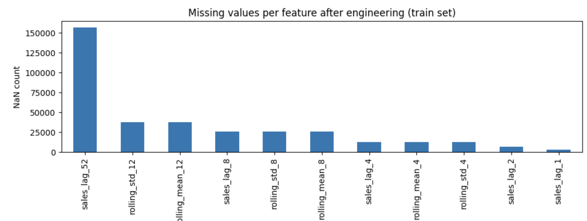

აქ ჩანს, რომ sales_lag_52-ს აქვს ყველაზე მეტი გამოტოვებული მნიშვნელობა, რადგან მას სჭირდება მთლიანი წლის ისტორია, რომელიც არ არის დატას პირველ წელში.

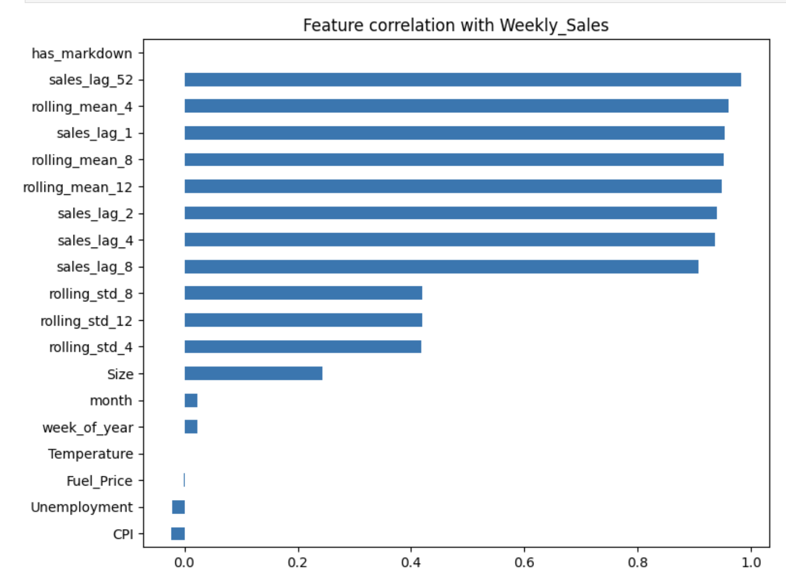

აღმოჩნდა, რომ lag და rolling feature-ები ძალიან მჭიდრო კავშირში არიან გაყიდვებთან (კორელაცია აქვთ 0.9-ზე მაღალი), როცა სხვა სვეტებს, მაგალითად ტემპერატურა, უმუშევრობა და ა.შ. თითქმის საერთოდ არ აქვთ კავშირი გაყიდვებთან.

**გადაწყვეტილება:** შეუვსებელი lag მნიშვნელობები, საერთოდ არ შევავს, რადგან LightGBM-ს შეუძლია ამასთან გამკლავება თვითონ (ტრენინგის დროს სწავობს).

---

### Feature Selection

ვცადე, რომ წამეშალა ის feature-ები, რომლებიც არ იყო მნიშვნელოვანი, რომ მენახა ამაზე მოდელი უკეთესად იმუშავებდა თუ არა.

**პირველი ცდა (არასწორი მეთოდი):** გამოვიყენე "split-based" importance, რაც ითვლის feature რამდენჯერ იყო გამოყენებული ხის სპლიტისთვის. ეს მეთოდი არასწორია, რადგან feature-ები, რომელბსაც  ბევრი შესაძლო მნიშვნელობა აქვთ (მაგალითად, ტემპერატურა) გამოიყენება მეტ სპლიტში შემთხვევით, თუნდაც ეს სპლიტი დიდად არ ეხმარებოდეს. ამ მეთოდით წავშალე 6 feature და უარესი შედეგები მივიღე.

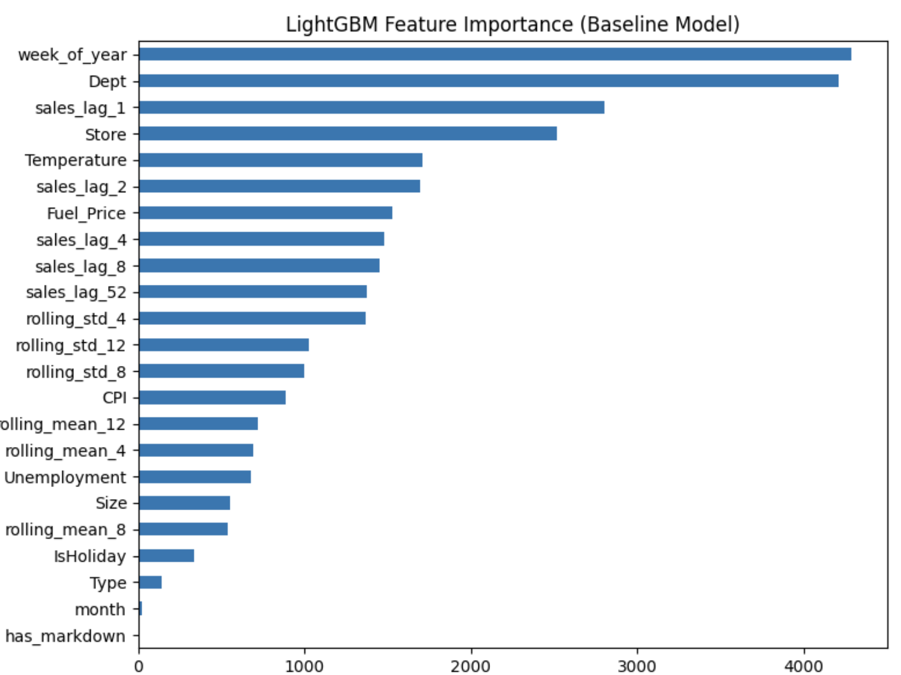

**მეორე ცდა (სწორი):** გამოვიყენე "gain-based" improtance, წაც ზომავს, feature-მა რამდენად შეამცირა prediction error. ეს მაძლევს უფრო გონივრულ რანკინგს.

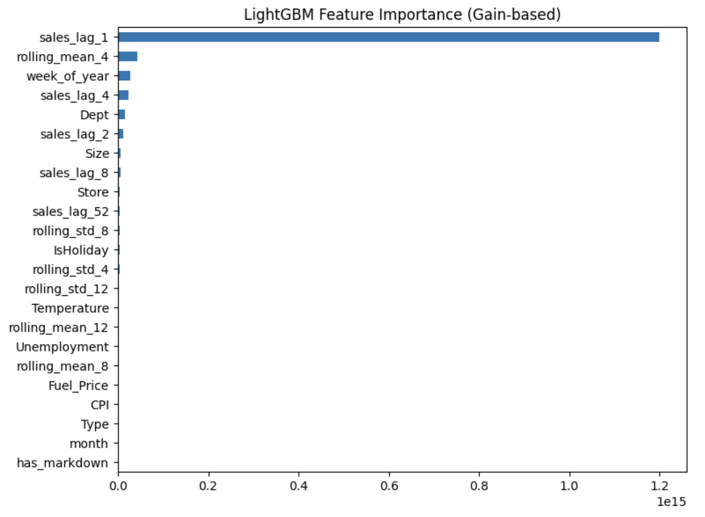

**შედარება:**

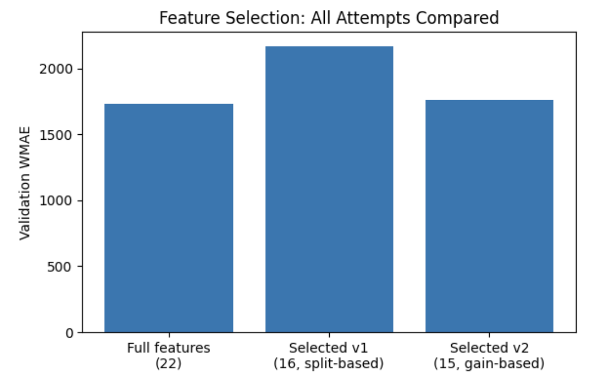

როგორც ხედავთ, ყველაზე უკეთესია, რომ არ გამოვიყენოთ ყველა feature. მათმა წაშლამ უარესი შედეგები გამოიწვია.

**ამიტომ, საბოლოოდ, დავტოვე ყველა feature ტრენინგისთვის**

---

### Training

### Hyperparameter Search

დავტესტე 11 სხვადასხვა ჰიპერპარამეტრის კონფიგურაცია. თითოეული ტესტავს კონკრეტულდ იდეას (მარტივი მოდელი, კომპლექსური, ოვერფიტი, ანდერფიტი, ნელი სწავლება, სწრაფი სწავლება, რეგულარიზაციით, row/column სემპლინგით).

გამოვიეყენე 3-fold time-based cross-validation (თითოეული ფოლდი იყენებს ძველ მონაცემებს მომავლის პრგონოზისთვის და არასდროს ხდება პრიქით).

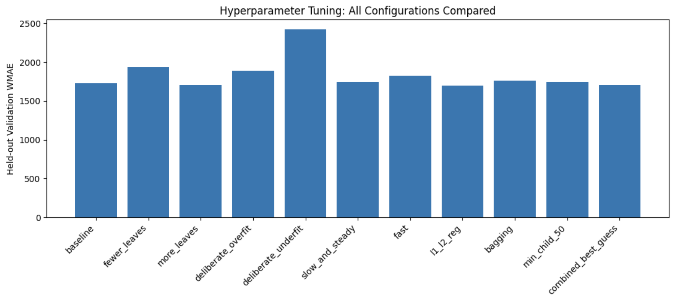

| Config | CV Mean WMAE | CV Std | Held-out WMAE |
|---|---|---|---|
| baseline | 1444.56 | 114.83 | 1728.32 |
| fewer_leaves | 1545.65 | 69.38 | 1938.85 |
| more_leaves | 1451.40 | 180.06 | 1702.40 |
| deliberate_overfit | 1432.88 | **206.44** | **1887.41** |
| deliberate_underfit | 1699.03 | 83.39 | 2425.57 |
| slow_and_steady | 1461.25 | 129.25 | 1746.87 |
| fast | 1546.64 | 110.73 | 1824.23 |
| **l1_l2_reg (საუკეთესო)** | 1427.75 | 149.25 | **1698.50** |
| bagging | 1457.32 | 139.66 | 1763.81 |
| min_child_50 | 1458.85 | 157.66 | 1741.68 |
| combined_best_guess | 1424.66 | 153.38 | 1704.42 |

საინტერესოა, რომ deliberate_overfit-ს ჰქონდა კარგი საშუალო CV score, მაგრამ ჰქონდა ყველაზე მაღალი CV სტანდარტული გადახრა და ყველაზე ცუდი held-out score. ეს არის ოვერფიტი.

**საუკეთესო:** `l1_l2_reg` (L1/L2 regularization), held-out WMAE 1698.50.

### Systematic Search 

ამის შემდეგ, გადავწყვიტე უფრო მეტა გამეტესტა საუკეთესო კონფიგურაციის გარშემო (num_leaves, reg_alpha და reg_lambda-ის 27 კომბინაცია). აქ არ გამოვიტენე GridSearchCV, რადგან ამას არ შეუძლია დანახვა რომელი კვირა არის ჰოლიდეი და ოპტიმიზაციას გააკეთებდა უბრალოდ MAE-ს მიხედვით. მე გავაკეთე ჩემი search loop, გამოვიყენე, ცხადია, WMAE.

**საუკეთესო:** `num_leaves=127, reg_alpha=0.5, reg_lambda=2.0`, held-out WMAE: **1696.79**.

---

### პრობლემა: Validation Score არ იყო რეალისტური

ყველა რიცხვი კარგად გამოიყურებოდა, მაგრამ შეცდომაში შემყვანი აღმოჩნდა.

ჩემმა ვალიდაციის ტესტმა მოდელს cheating-ის საშუალება მისცა. როდესაც ამოწმებდა lag feature-ებს, მაგალითად გაყიდვებს 1 კვირის წინ, ნამდვილი ისტორიული გაყიდვების მნიშვნელობები ყოველთვის ხელმისწავდომი იყო ვალიდაციის დატაში. მაგრამ ნამდვილ kaggle-ის ტესტ სეტში, მომავალი კვირების გაყიდვები არ არსობებს ჯერ, მოდელმა უნდა დააფრედიქთოს პირველი კვირა, მერე გამოიყენოს თავისი პროგნოზი მეორე კვირისთვის და ასე შემდეგ. ეს ცნობილი პრობლემაა, რომელსაც compunding error ჰქვია.

გავაკეთე რეკურსიული forecasting ვერსია (დააფრედიქთე პირველი კვირა, უკან მივცე ეს შედეგი, გამეორება). იგივე feature-ების გამოყენებით, WMAE ახტა 1696.79-დან **2383.51**-მდე

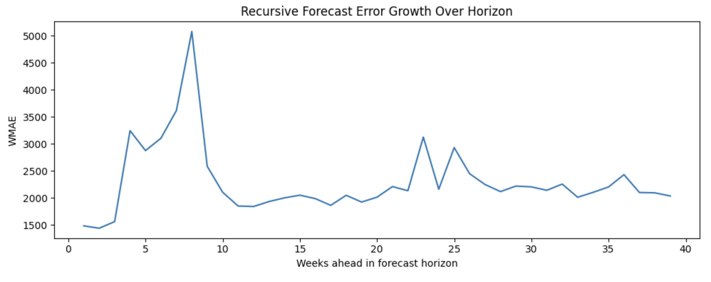

ჩანს, რომ ერორი მკვეთრად იზრდება 4-8 კვირაში (Thanksgiving და Christmas), რაც ამტკიცებს, რომ compounding პროვლემა ყველაზე ცუდია ჰოლიდეიების დროს.

### Compounding პრობლემის გამოსწორება: სარისკო lag-ების წაშლა

მოკლე lag feature-ებს (1, 2, 4 კვირები) ყველაზე მეტად ეხება compunding, რადგან ისინი დამოკიდებულნი არიან მოდელის ყველაზე ბოლო (და ალბათ ყველაზე არასწორ) პროგნოზთან. გავტესტე მათი წაშლა.

| Feature set | Recursive WMAE |
|---|---|
| მხოლოდ sales_lag_52 | 2195.52 |
| + sales_lag_8 | 2196.71 |
| **+ sales_lag_8 + rolling_mean_12 (საუკეთესო)** | **2145.20** |
| + sales_lag_4 + sales_lag_8 | 2211.57 |

**საუკეთესო:** დავიტოვოთ მხოლოდ `sales_lag_52`, `sales_lag_8` და `rolling_mean_12`. 

### Holiday-Week Blending

რადგან ჰოლიდეი კვირების პროგნოზი ყველაზე რთულია, ვცადე მოდელის პროგნოზი შემერია წინა წლის ნამდვილ გაყიდვებთან იგივე კვირისთვის("seasonal-naive"), მხოლოდ ჰოლიდეიებზე.

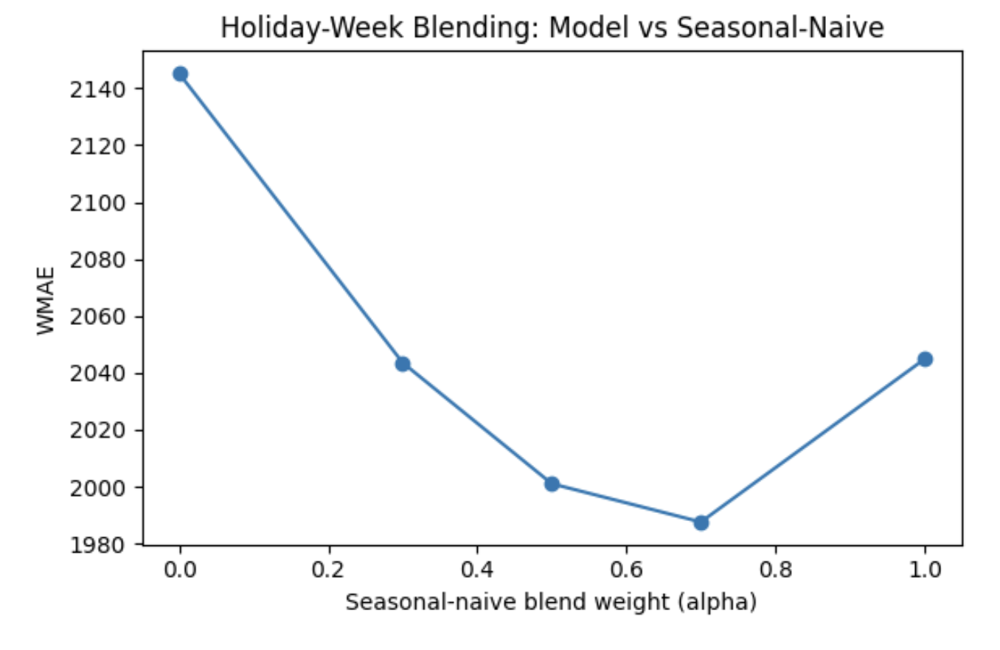

aplha=0.7 (70% წინა წლის მნიშვნელობა, 30% მოდელის ფრედიქშენი ჰოლიდეის კვირებზე მხოლოდ) აღმოჩნდა საუკეთსო. ეს ამარცხებს სუფთა მოდელსაც და seasonal-naive-საც.

### Holiday-Proximity Features (Rejected)

ასევე ვცადე დამემატებინა feature-ები: "weeks until Thanksgiving" და "weeks until Christmas".

| Setup | WMAE |
|---|---|
| Without proximity features + blend | 1987.57 |
| With proximity features, no blend | 2166.51 (უარესი) |
| With proximity features + blend | 1998.58 (უარესი) |

როგორც ცხრილში ჩანს, შედეგები გაუარესდა. ალბათ იმიტომ, რომ overlap ხდება იმ ინფორმაციასთან, რომელსაც მოდელი უკვე იღებს sales_lag_52-ისგან და ამ შერევისგან.

### Direct Multi-Horizon Modeling

ამის შემდეგ, 1 კვირის დაფრედიქთების და მერე შედეგის თავიდან გამოყენების (რეკურსიული) მაგივრად, გამოვიყენე ახალი მიდგომა: დავატრენინგე ერთი მოდელი, რომელიც იღებს input feature-ს, რომელიც ეუბნება რამდენი კვირის შემდეგ დააფრედიქთოს და აფრედიქთებს რომელიმე კვირას პირდაპირ, არასდროს იყენებს მის ძველ შედეგებს.

ეს Compounding-ის პრობლემა მთლიანად აგვარიდებს.

| მიდგომა | WMAE (no blend) |
|---|---|
| Recursive (საუკეთესო ვერსია) | 2145.20 |
| **Direct multi-horizon** | **1969.84** |

ამ ახალმა მიდგომამ უკვე მოიგო, იქამდე სანამ საერთოდ blending-ს დავამატებდი.

### Blending on Direct Multi-Horizon

| Blend weight (alpha) | WMAE |
|---|---|
| 0.0 | 1969.84 |
| 0.3 | 1902.88 |
| **0.5 (საუკეთესო)** | **1885.61** |
| 0.7 | 1895.64 |
| 1.0 | 1958.81 |

### Re-tuning Hyperparameters ახალი მიდგომისთვის

ეს მიდგომა იყენებს ბევრად დიდ ტრენინგ სეტს და ახალ feature-ს (რამდენი კვირის შემდეგ), ამიტომ თავიდან გავაკეთე სერჩი:

| Config | Held-out WMAE |
|---|---|
| num_leaves=127, trees=500 (old setting) | 1969.84 |
| num_leaves=255, trees=500 | 1907.31 |
| num_leaves=255, trees=1000 | 1864.25 |
| **num_leaves=511, trees=1000 (საუკეთსო)** | **1856.76** |
| num_leaves=255, trees=500, faster learning | 1901.00 |

**საუკეთსო:** `num_leaves=511, n_estimators=1000, reg_alpha=1.0, reg_lambda=2.0`.
ამან გააუმჯობესა WMAE 5.7%-ით.

### საბოლოოდ blend

ახალი ჰიპერპარამეტრებით, კიდევ გავაკეთე blend wieght search.

| Alpha | WMAE |
|---|---|
| 0.3 | 1817.61 |
| 0.45 | 1811.12 |
| **0.5 (საუკეთესო)** | **1811.11** |
| 0.55 | 1812.27 |
| 0.7 | 1822.97 |

**საბოლოოდ საუკეთესო: alpha = 0.5, WMAE = 1811.11**

### True Target-Relative Seasonal Feature (Rejected)

ვცადე მოდელისთვის მიმეცა feature, რომელიც ეტყოდა გაყიდვებს ზუსტად ამ კვირას, 1 წლის წინ, ბლენდინგის მაგივრად.

| Version | WMAE |
|---|---|
| ამის გარეშე (ახლანდელი საუკეთესო) | 1811.11 |
| ამ feature-ით, missing values იგივენაირად არის | 1931.59 (უარესი) |
| ამ feature-ით, missing values შევსებულია| 2149.01 (უფრო უარესი) |

missing value-ების შევსებამ უარესი შედეგი გამოიწვია, რადგან ეს feature იმეორებს ინფორმაციას რაც მოდელმა უკვე იცის sale_laf_1-დან და rolling საშუალოებიდან. ეს კი უბრალოდ ამატებს noise-ს.

---

### LightGBM საბოლოო მოდელი

| კონფიგურაცია | Value |
|---|---|
| მიდგომა | Direct multi-horizon (single model, no recursive feeding) |
| num_leaves | 511 |
| learning_rate | 0.05 |
| n_estimators | 1000 |
| reg_alpha | 1.0 |
| reg_lambda | 2.0 |
| Holiday blend weight | 0.5 |
| Cold-start handling | Shared team function (median sales by Store Type + Department, last 52 weeks, minimum 0) |
| Trained on | Full training history (4,806,902 rows) |

**Internal validation WMAE: 1811.11**

### Kaggle Score

| Metric | Score |
|---|---|
| Public Leaderboard | 2751.90 |
| Private Leaderboard | 2642.17 |

ეს აშკარად უფრო დიდია, ანუ უარესია ვიდრე ჩემი validation score. ამან დამაეჭვა, ამიტომ გამოვიკლვიე ეს საკითხი უფრო ღრმად.

გავტესტე იგივე მოდელი განსხვავებულ პერიოდზე (May 2011 - Jan
2012), რათა მენახა ეს gap ნორმალური იყო თუ შეცდომის ნიშანი.

| Validation window | Holidays included | WMAE |
|---|---|---|
| Window 1 (Nov 2011 - Jul 2012) | Super Bowl, Labor Day only | 2145.20 |
| Window 3 (May 2011 - Jan 2012) | Thanksgiving, Christmas, Super Bowl, Labor Day | 3168.27 |

WMAE ამ დატასეტზე ძალიან იცვლება იმის მიხედვით, თუ რომელი კონკრეტული ჰოლიდეიები არიან ტესტირებულ პერიოდში. პირველი ფანჯარა მარტივი ჩანდა, რადგან Thanksgiving და Christmas არ იყო. მესამეში და რეალურ kaggle-ის ტესში ორივე ჰოლიდეი იყო და ორივე უარესი შედეგი მომცა. ეს აჩვენებს, რომ gap არის დატასეტის ბრალი და არა ჩემი მოდელის.

### ერორი ჰოლიდეის ტიპის მიხედვით (ნამდვილ ტესტ სეტში)

| Week type | WMAE |
|---|---|
| Christmas | 2420.20 |
| Thanksgiving | 2184.21 |
| Regular week | 1704.16 |
| Super Bowl | 1589.99 |

ეს ემთხვევა იმას, რასაც ველოდით EDA-დან: Christmas და Thanksgiving ყველაზე რთულია დასაფრედიქთებლად, Super bowl კი უფრო მარტივია ვიდრე ჩვეულებრივი კვირა.

## XGBoost (Tabular / Tree-Based Model)

ამ სექციაშ ვისაუბრებ XGBoost-ზე. რადგანაც XGBoost-ც არის ხის მოდელი, როგორც LightGBM, bevri gadawyvetileba (cleaning, features, ზოგადი სტრატეგია) იგივეა. ყველა ექსპერიმენტი დალოგილია XGboost_Training-ში.

### Data Cleaning, validation split

აქ გამოვიყენე იგივე საერთო წესი, რაც ყველა მოდელს აქვს ჩვენს პროექტში.

### Feature Engineering

აქ გამოვიყენე ზუსტად იგივე feature set, რომელიც LightGBM-ში.

| Feature type | Features |
|---|---|
| Lag features | გაყიდვები 1, 2, 4, 8, და 52 კვირის უკან |
| Rolling stats | Rolling საშუალო და სტანდარტული გადახრა, 4, 8, 12 კვირებზე |
| Calendar | წლის კვირა, თვე და isHoliday |
| Store info | Store Size, Store Type |
| სხვა | Temperature, Fuel Price, CPI, Unemployment, has_markdown flag |

### Feature Selection

LightGBM-დან უკვა ვისწავლეთ, რომ split-based importance არსწორი იყო. XGBOOST-ისთვის, ეს შეცდომა გავითვალისწინე და პირდაპირ gain-based impoertance გამოვიყენე.

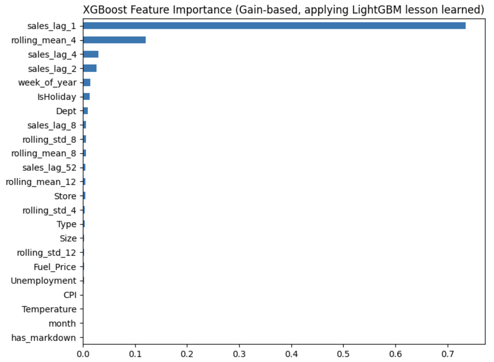

რანკინგი დაახლოებით იგივე რამეს გვეუბნება, რაც LightGBM-ში იყო: sales_lag_1 დომინირებს მთლიანად, rolling_mean_4 არის მეორე და ყველა დანარჩენი ჩამორჩება ამათ ბევრად.

| Feature set | Validation WMAE |
|---|---|
| მთლიანი feature set (23 features) | 1730.63 |
| Selected (16 features, 7 lowest-gain dropped) | 1713.26 |

**საინტერესო განსხვავება LightGBM-სგან:** LightGBM-ში, ყველა feature-ის დატოვება იყო საუკეთესო გადაწყვეტილება. XGBoost-ში 8 lowest-gain feature-ების (has_markdown, month, Temperature, CPI, Unemployment, Fuel_Price, rolling_std_12) ამოღება დაგვეხმარა. ეს გვიჩვენებს, რომ იგივე გადაწყვეტილებას შეიძლება საწინააღმდეგო შედეგი ჰქონდეს სხვადახსხვა მოდელზე.
---

### Training

### Hyperparameter Search 

აქ იგივე მიდგომა გამოვიყენე რაც lightGBM-ში: 11 ამორჩეული კონფიგურაცია, თითოეული ტესტავს კონრკეტულ იდეას, 3-fold time-based cross validation და held-out check.

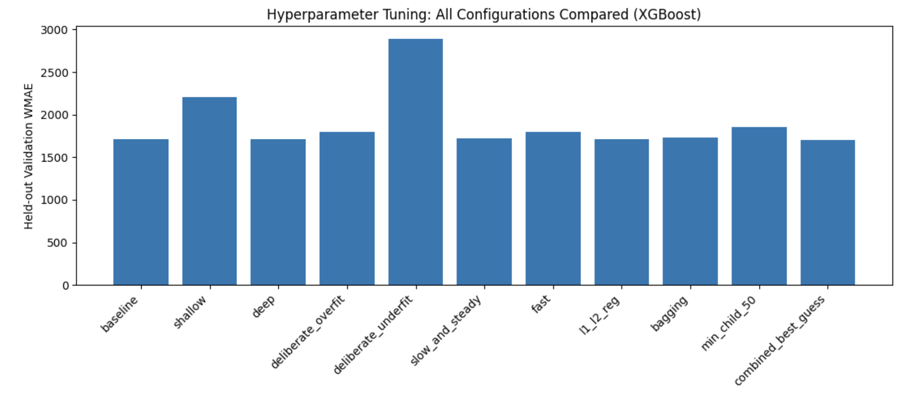

| Config | CV Mean WMAE | CV Std | Held-out WMAE |
|---|---|---|---|
| baseline | 1467.61 | 138.50 | 1713.26 |
| shallow | 1651.06 | 235.05 | 2204.82 |
| deep | 1354.78 | 162.33 | 1707.75 |
| deliberate_overfit | 1396.16 | 173.71 | 1796.69 |
| deliberate_underfit | 1914.60 | 88.51 | 2893.90 |
| slow_and_steady | 1450.20 | 129.32 | 1721.55 |
| fast | 1479.15 | 162.59 | 1797.07 |
| l1_l2_reg | 1352.72 | 167.38 | 1710.00 |
| bagging | 1419.59 | 128.94 | 1728.69 |
| min_child_50 | 1441.30 | 128.19 | 1858.89 |
| **combined_best_guess (საუკეთესო)** | **1357.21** | 135.39 | **1706.23** |

**განსხვავება LightGBM-სგან:** XGboost-ში shallo და deliberate_underfit ორივე კონსისტენტურად ხუდი იყო ყველაგან, ანდერფიტში იყვნენ. ამან მაჩვენა, რომ xgboost-ს ამ დატაზე სჭირდებოდა კარგი სიღრმეები, სიმარტივე აქ უფრო აფუჭებდა საქმეს, ვიდრე კომპლექსურობა.

**საუკეთესო:** `combined_best_guess`, held-out WMAE 1706.23.

### Systematic Search 

27 კომბინაცია `max_depth` (6, 8, 10), `reg_alpha`, და `reg_lambda`
(0.25, 0.5, 1.0 each). დაისერჩა საუკეთესო კონფიგურაციის გარშემო.

შეიმჩნეოდა პატერნი, რომ max_depth=10 ამარცხებდა ყველა max_depth=8 კონფიგურაციას, ეს კი ამარცხებდა ყველა max_depth=6 კონფიგურაციას. სიღრმე უფრო მნიშვნელოვანი იყო, ვიდრე რეგულარიზაცია.

**საუკეთსო:** `max_depth=10, reg_alpha=1.0, reg_lambda=1.0`, held-out WMAE
**1665.63**.

### 6. Skipping Recursive Forecasting

LightGBM-ში აღმოვაჩინეთ რეკურსიული forecasting-ის პრობლემა, რომელსაც აქ აღარ გავიმეორბ, ცხადია. compounding error ამ შემთხვევაში არაა დამოკიდებული თუ რომელ ხის ალგორითმს გამოვიყენებ. XGnoost ზუსტად იგივე sales_lag_1/sales_lag_2-ს იყენებს, იგივე პორბლემით.

ამიტომ, პირდაპირ direct multi-horizon modeling გამოვიყენე,

### Direct Multi-Horizon Modeling

იგივე იდეაა, რაც lightgm-ში: ერთ მოდელს ვატრენინგებთ, რომელიც input feature-ად მიიღებს კვირის რაოდენობას, რამდენი კვირით წინაც უნდა დააფრედიქთოს და აფრედიქთებს ნებსიმიერ კვირას პირდაპირ, მხოლოდ ნამდვილი დატას გამოყენებით.

`max_depth=10, reg_alpha=1.0, reg_lambda=1.0`: **WMAE = 1907.52** (no blend). 

### Holiday-Week Blending

მოდელის ფრედიქშენებს შევურევთ წინა წლის ნამდვილ გაყიდვებთან, მხოლოდ ჰოლიდეი კვირებში:

| Blend weight (alpha) | WMAE |
|---|---|
| 0.0 | 1907.52 |
| 0.3 | 1862.64 |
| **0.45 (საუკეთესო)** | **1855.32** |
| 0.5 | 1855.61 |
| 0.55 | 1857.40 |
| 0.7 | 1870.59 |
| 1.0 | 1936.65 |

**საუკეთესო:** alpha=0.45, WMAE 1855.32, 2.7% გაუმჯობესება.

### ახალი მიდგომისთვის ჰიპერპარამეტრების re-tuning

| Config | Held-out WMAE |
|---|---|
| max_depth=10, lr=0.03, trees=800 (old setting) | 1907.52 |
| max_depth=14, lr=0.03, trees=800 | 1883.19 |
| max_depth=14, lr=0.03, trees=1200 | 1888.08 |
| **max_depth=10, lr=0.05, trees=1000 (winner)** | **1881.91** |
| max_depth=12, lr=0.05, trees=1000 | 1883.85 |

საუკეთესოს აქვს იგივე სიღრმე (10) რაც მაქამდე, თუმცა ცოტათი უფრო მაღალი learning rate და მეტი ხე. მან დაამარცხა კონფიგურაციები, რომლებიც უფრო ღრმად ჩავიდნენ. ეს აჩვენებს, რომ მხოლოდ მეტი სიღრმე არ არის პასუხი, სწორი კომბინაციები უფრო მნიშვნელოვანია

**საუკეთესო:** `max_depth=10, learning_rate=0.05, n_estimators=1000,
reg_alpha=1.0, reg_lambda=1.0`. WMAE გაუმჯობესდა 1.4%-ით.

### Final Blend Sweep

| Alpha | WMAE |
|---|---|
| 0.3 | 1843.99 |
| 0.4 | 1839.15 |
| **0.45 (საუკეთესო)** | **1838.88** |
| 0.5 | 1840.30 |
| 0.55 | 1842.88 |
| 0.6 | 1846.30 |
| 0.7 | 1856.90 |

### Early Stopping Check

სანამ საბოლოოდ შევარჩევთ, შევამოწმე n_estimators=1000 თუ იყო სწორი, xgboost-ის early stopping-ით (მაქს 300 ხე, გაჩერდება 50 რაუნდის შემდეგ გაუმჯობესების გარეშე).

შედეგი: მოდელ ბუნებრივად გაჩერდა 1027-ე იტერაციაზე, რაც თითქმის ზუსტად ემთხვევა ჩემს არჩეულ 1000-ს, დაახლოებით იგივე WMAE-თი (1880.70 vs 1881.91).

### საბოლოო მოდელი

| Setting | Value |
|---|---|
| მიდგომა | Direct multi-horizon (single model, no recursive feeding) |
| max_depth | 10 |
| learning_rate | 0.05 |
| n_estimators | 1000 |
| reg_alpha | 1.0 |
| reg_lambda | 1.0 |
| subsample | 0.8 |
| colsample_bytree | 0.8 |
| min_child_weight | 20 |
| Holiday blend weight | 0.45 |
| Cold-start handling | median sales by Store Type + Department, last 52 weeks, minimum 0 |
| Trained on | Full training history |

**Internal validation WMAE: 1838.88**

### 9. Kaggle-ის ქულა

| Metric | Score |
|---|---|
| Public Leaderboard | 2656.01 |
| Private Leaderboard | 2769.88 |

### XGBoost-ის da LightGBM-ის შედარება

| მოდელი | Public | Private |
|---|---|---|
| LightGBM | 2751.90 | 2642.17 |
| XGBoost | 2656.01 | 2769.88 |

ამ ორი ქულის მიხედვით, რთულია თქმა რომელია უკეთსი. XGBoost იგებს public ლიდერბორდზე, თუმცა lightGBM private-ზე. WMAE ამ დატასეტში დიდად არის დამოკიდებული რომელ კონკრეტულ კვირებს ვიყენებთ. კაგლის public და private-ები სხვადასხვა ქვესმირავლეებს იყენებენ.

რადგან შიდა ვალიდაცია და private ლიდერბორდის შედეგები lightGBM-ს უკეთესი აქვს, ამ ორს შორის ავირჩევთ lightGBM-ს.

# classical Statistical Time-Series Models

## ARIMA და SARIMA 

ეს ორი ნოუთბუქი არის თეორიაზე კონცენტრირებული და გაიტესტა პატარა რაოდენობაზე.

ყველა ექსპერიმენტი დალოგილია `ARIMA_Training`-სა და `SARIMA_Training`-ში.

---

## ARIMA

## რა არის ARIMA?

ARIMA არის AutoRegressive Integrated Moving Average. მას აქცს სამი კონფიგურაცია: (p, d, q).

- **p**: რამდენი ძველი მნიშვნელობები დაეხმარება შემდეგი მნიშვნელობის ფრედიქშენში
- **d**: რამდენჯერ უნდა განხორციელდეს დიფერენცირება (ყოველი მნიშვნელობიდან წინა მნიშვნელობის გამოკლება), რათა მონაცემებიდან მოიხსნას ტრენდი.
- **q**: რამდენი ძველი ფრედიქშენ ერორ ეხმარება შემდეგი ფრედიქშენის გასოწრებაში.

ARIMA-ს შეუძლია გაუმკლავდეს ტრენდს, მაგრამ მას არ აქვს seasonality-ის კონცეპტი. მას არ შეუძლია თქვას, რომ ეს პატერნი ყოველ წელს მეორედება.

### Data Cleaning and Validation Split

იგივე, რაც სხვა ნოუთბუქებში.

### Representative Series

რადგანაც ARIMA-ს ტრენინგი ყველა 3300 სერიაზე ინფივიდუალურად დიდ დროს წაიღებდა პატარა ბეენფიტისთვის, ავიჩიე 3 სერია, რომელიც აჩვენებდა განსახვავებულ პატერნს:

- **Store 1, Dept 1**: ყოველწლიურად შობის პერიოდში გაყიდვები მკვეთრად იზრდება, ხოლო დანარჩენ დროს დაბალი და თითქმის უცვლელია.
- **Store 4, Dept 92**: კვირიდან კვირამდე მონაცემები უფრო მერყეობს, თუმცა დროთა განმავლობაში შეინიშნება გაყიდვების ნელი ზრდის ტენდენცია
- **Store 20, Dept 1**: ყოველწლიური პიკები კიდევ უფრო მკვეთრია (გაყიდვები ნორმალურ დონეს დაახლოებით 6-ჯერ აღემატება).

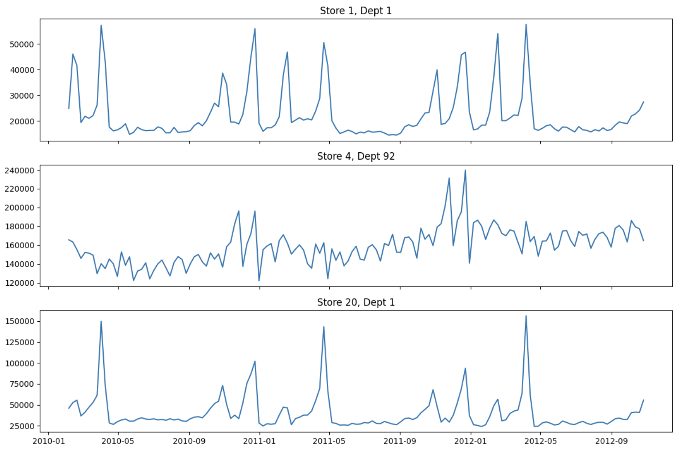

### Stationarity Testing

გამოვიყენე ADF ტესტი, რომელიც ამოწმებს სერიებს აქვს თუ არა სტაბილური საშუალო დროთა განმავლობაში.

| Series | ADF p-value (raw) | Stationary? |
|---|---|---|
| Store 1, Dept 1 | 0.1102 | არა |
| Store 4, Dept 92 | 0.4991 | არა |
| Store 20, Dept 1 | 0.0000 | კი |

ADF ტესტი ამოწმებს მხოლოდ ტრენდისა და დრიფტის არსებობას და არა სეზონურობას. მიუხედავად იმისა, რომ Store 
20-ს  ყველაზე დიდი სეზონური პიკები აქვს, ADF ტესტმა ის მაინც სტაციონარულად მიიჩნია, რადგან ყოველი პიკის შემდეგ მონაცემები ყოველთვის ერთსა და იმავე ბეიზლაინს უბრუნდება და გრძელვადიანი დრიფტი არ შეინიშნება. სამივე სერიაში მაინც აშკარად ჩანს ძლიერი წლიური სეზონურობა, უბრალოდ, ADF ტესტი სეზონურობას საერთოდ არ ამოწმებს.

### Differencing (Store 4, Dept 92)

| ვერსია | ADF p-value | Stationary? |
|---|---|---|
| Raw | 0.4991 | No |
| After trend differencing (d=1) | 0.0000 | კი |
| After seasonal differencing only (D=1, lag 52) | 0.1750 | არა |
| **After both (d=1 and D=1, lag 52)** | **0.0000** | **Yes (ძლიერი)** |

მხოლოდ სეზონურმა დიფერენცირებამ სტაციონარულობის მიღწევა ვერ უზრუნველყო. ეს ლოგიკურიცაა: სეზონური 
დიფერენცირება მხოლოდ ყოველწლიურად განმეორებად პატერნს აშორებს, ხოლო ნელ, გრძელვადიან ზრდით 
ტენდენციას (დრიფტს) საერთოდ არ ეხება. Store 4-ში ორივე პრობლემა ერთდროულად გვხვდება. სწორედ ამიტომ 
SARIMA მოდელი ერთად იყენებს ტრენდის დიფერენცირებას (d) და სეზონურ დიფერენცირებას (D), ისინი ორ 
განსხვავებულ პრობლემას აგვარებენ.

### 5. ACF და PACF ანალიზი

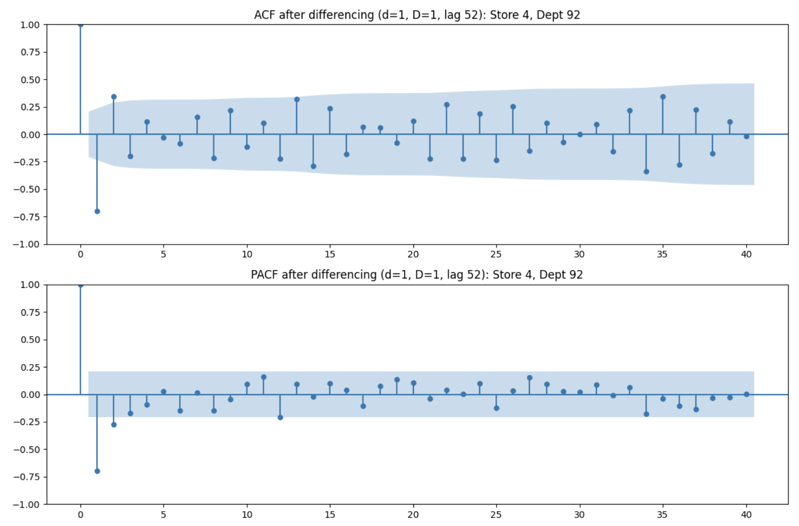

lag 1-ზე ორივეში არის ძლიერი ნეგატიური პიკი ორივე ჩარტში (დაახლოებით -0.70). ეს ჩვეულებრივი რამ არის და მიუთითებს უფრო მარტივი მოდელისკენ: p=0 ან 1, q=1. 

### Fitting ARIMA(1,1,1)

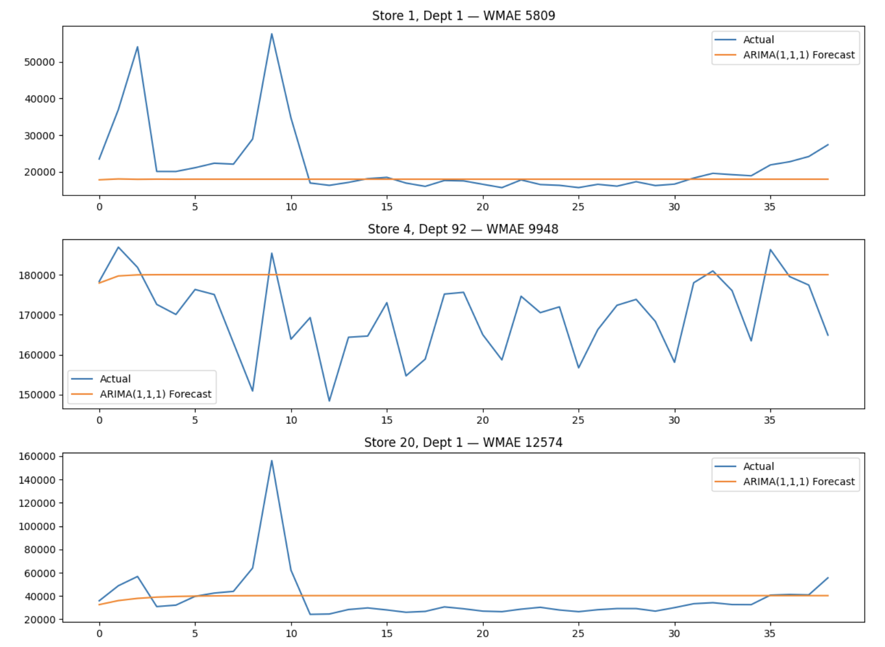

| Series | ARIMA(1,1,1) WMAE |
|---|---|
| Store 1, Dept 1 | 5809.04 |
| Store 4, Dept 92 | 9948.18 |
| Store 20, Dept 1 | 12573.51 |

lightGBM-თან და XGBoost-თან შედარებით არიმა 3-7-ჯერ უარესია.

გრაფიკზე დაკვირვებისას ჩანს, რომ ARIMA-ს პროგნოზი სწრაფად თითქმის სწორ ხაზად იქცევა, 
რომელიც მთელი 39-კვირიანი პროგნოზირების პერიოდის განმავლობაში თითქმის უცვლელი რჩება. ის სრულად ვერ 
ამჩნევს მადლიერების დღისა და შობის პიკებს, რადგან ARIMA-ს არ აქვს საშუალება 
იცოდეს, როდის დადგება დღესასწაული. 

ამ პრობლემებს SARIMA მოაგვარებს.

---

## SARIMA

SARIMA = Seasonal ARIMA. ეს ამატებს კიდევ 4 კონფიგურაციას (p, d, q): (P, D, Q, m). P, D, Q იგივეა, მაგრამ სეზონურ დონეზე და m არის ერთი მთლიანი სეზონური ციკლის სიგრძე. ჩვენს შემთხვევაში m=52.

### Representative Series

დავიტოვე იგივე 3 სერია ARIMA-დან და 2 დავამატე.

- **Store 10, Dept 30**: უფრო ხმაურიანია და შეინიშნება აშკარა ცვლილება. მონაცემების გარკვეულ ეტაპზე გაყიდვების საერთო დონე მნიშვნელოვნად მცირდება.

- **Store 33, Dept 40**: ძირითადად ხასიათდება სტაბილური ზრდის ტენდენციით, ხოლო სეზონურობა შედარებით 
სუსტი აქვს.

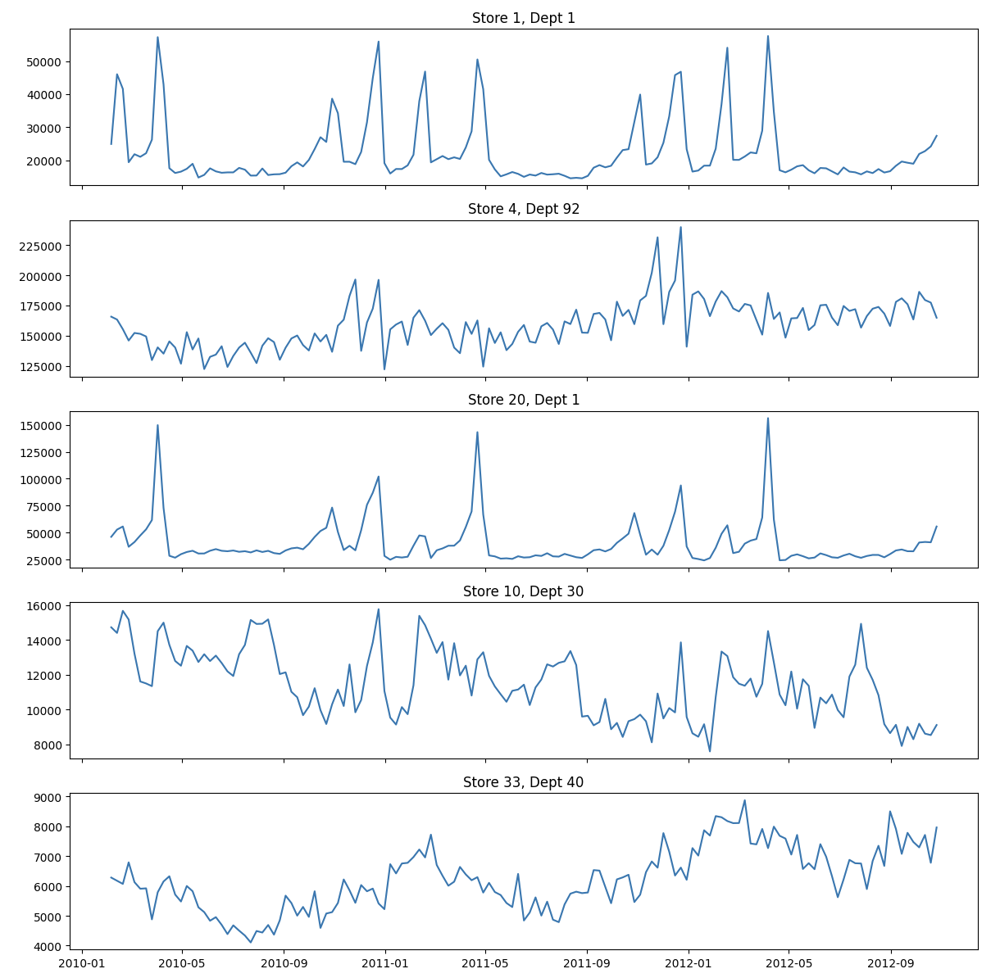

### Stationarity

| Series | Raw ADF p-value | Combined (d=1, D=1) p-value |
|---|---|---|
| Store 1, Dept 1 | 0.1102 (No) | 0.0000 (Yes) |
| Store 4, Dept 92 | 0.4991 (No) | 0.0000 (Yes) |
| Store 20, Dept 1 | 0.0000 (Yes) | 0.0000 (Yes) |
| Store 10, Dept 30 | 0.0001 (Yes) | 0.0000 (Yes) |
| Store 33, Dept 40 | 0.5409 (No) | 0.0000 (Yes) |

ყველა სერის გახდა სტაციონარული კომბინირებული დიფერენცირების შემდეგ, გამონაკლისების გარეშე. ეს 
ადასტურებს, რომ d=1 და D=1 არის უსაფრთხო და განზოგადებადი არჩევანი სხვადასხვა ტიპის სერიისთვის
(ძლიერი სეზონურობით, ხმაურიანი მონაცემებით, დომინანტური ტრენდით).

### Baseline

სანამ დავფიტავდი, შევამოწმე მარტივი ბეიზლაინი, უბრალოდ გავიმეოროთ თითოეული კვირის მნიშნელობა 52 კვირით წინანდელიდან.

| Series | Seasonal-Naive WMAE |
|---|---|
| Store 1, Dept 1 | 3486.27 |
| Store 4, Dept 92 | 14145.40 |
| Store 20, Dept 1 | 8089.12 |
| Store 10, Dept 30 | 1195.29 |
| Store 33, Dept 40 | 1337.74 |

### 11. Seasonal-Naive Baseline

ეს მარტივი საბაზისო მოდელი უკვე აჯობებს ჩვეულებრივ ARIMA(1,1,1) მოდელს იმავე სერიებზე. ეს ლოგიკურია: გასული წლის რეალური მნიშვნელობის უბრალოდ გამეორება ავტომატურად „იცის“, რომ დღესასწაულები ახლოვდება, მაშინ როცა ARIMA-ს ამის ცოდნა არ შეუძლია.

### Fitting SARIMA(1,1,1)(1,1,1,52)

| Series | SARIMA WMAE | Seasonal-Naive WMAE |
|---|---|---|
| Store 1, Dept 1 | 3544.35 | 3486.27 |
| Store 4, Dept 92 | 8992.83 | 14145.40 |
| **Store 20, Dept 1** | **165,892,885,846,051,008 (!)** | 8089.12 |
| Store 10, Dept 30 | 1163.20 | 1195.29 |
| Store 33, Dept 40 | 655.70 | 1337.74 |

Store 20-ის მნიშვნელობა გამოვიკვლიე დეტალურად.

- Store 20-ს მხოლოდ 104 კვირის (ზუსტად 2 სრული სეზონური ციკლის) ტრენინგ მონაცემები ჰქონდა.
- fitted AR კოეფიციენტი გამოვიდა 2.5229, რაც სტაბილური პროგნოზისთვის საჭირო დიაპაზონს (დაახლოებით
-1-დან 1-მდე) სცდება.
- ორივე სეზონური პარამეტრი ზუსტად 0-ის ტოლი აღმოჩნდა, რაც ნიშნავს, რომ მონაცემების რაოდენობა საკმარისი არ იყო (მხოლოდ 2 სეზონური ციკლი), რათა მოდელს მათი საიმედოდ შეფასება შეძლებოდა.
- რადგან სეზონური ნაწილი ნულზე დარჩა, არასეზონურმა AR კომპონენტმა სცადა ამ ნაკლებობის კომპენსირება და გახდა არასტაბილური, რის შედეგადაც 39-კვირიანი პროგნოზი სტაბილურად ჩამოყალიბების ნაცვლად ექსპონენციურად გაიზარდა.

ამიტომ უფრო მარტივი, უფრო შეზუღდული მოდელი გამოვიყენოთ: SARIMA(0,1,1)(0,1,1,52).

| Version | Store 20 WMAE |
|---|---|
| SARIMA(1,1,1)(1,1,1,52) | 165,892,885,846,051,008 (diverged) |
| SARIMA(0,1,1)(0,1,1,52) | 10,654.37 (stable) |
| Seasonal-naive | 8089.12 |

შეზღუდულმა ვერსიამ არასტაბილურობა გამოასწორა, თუმცა ის მაინც უარეს შედეგს აჩვენებს, ვიდრე მარტივი ბეიზლაინი. Store 20-ს ხუთივე სერიას შორის ყველაზე ექსტრემალური პიკები აქვს (ნორმალურ დონესთან 
შედარებით 6-ჯერ უფრო მაღალი), ხოლო მხოლოდ 2 წლის ისტორიული მონაცემების არსებობის პირობებში SARIMA-ს არ 
შეუძლია ასეთი მკვეთრი ნიმუშის საიმედოდ სწავლა. ზოგჯერ მარტივი მიდგომა  უკეთესი არჩევანია.

| Series | Winner |
|---|---|
| Store 1, Dept 1 | Naive (barely) |
| Store 4, Dept 92 | SARIMA |
| Store 20, Dept 1 | Naive |
| Store 10, Dept 30 | SARIMA (barely) |
| Store 33, Dept 40 | SARIMA |

SARIMA იგებს 3 სერიაში, naive იგებს 2-ში. შერეული შედეგია, ვერ ვიტყვითი, რომ SARIMAA უკეთსია ყოველთვის.

### Residual Diagnostics (Store 33, Best Fit)

იმის შესამოწმებლად, იყო თუ არა ჩვენი საუკეთესო შედეგის მქონე მოდელი ნამდვილად კარგი, შევამოწმე, დარჩა თუ არა მის შეცდომებში რაიმე პროგნოზირებადი სტრუქტურა.

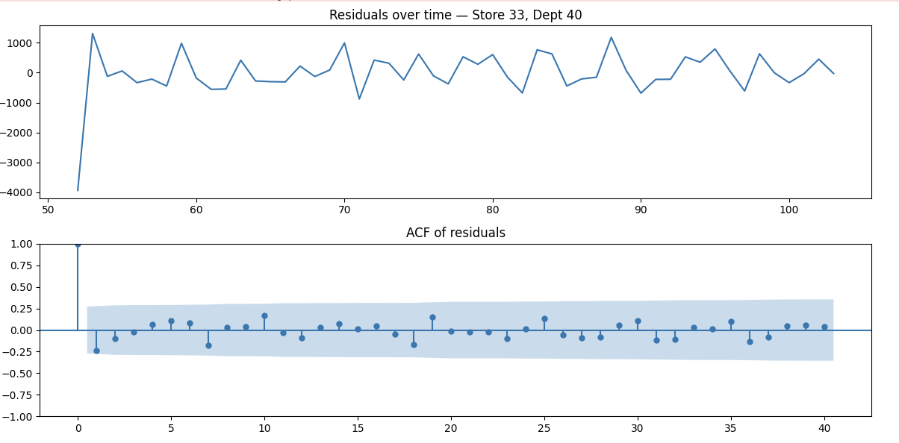

- residual-ები რენდომად მერყეობს ნულის გარშემო და არ აჩვენებს დარჩენილ რაიმე თვალსაჩინო სტრუქტურას ან ნიმუშს.
- რეზიდუალების ACF გრაფიკში არც ერთ ლაგზე არ ჩანს მნიშვნელოვანი პიკი, მათ შორის არც 52-ე ლაგთან (წლიურ სეზონურობასთან ახლოს).
- Ljung-Box ტესტის p-მნიშვნელობები: 0.51, 0.77, 0.85 (ყველა მნიშვნელოვნად აღემატება 0.05-ს).

დასკვნა: მოდელმა ამ სერიაში არსებითად ყველაფერი, რაც შესაძლებელი იყო სასწავლად, უკვე დაიჭირა. რაც დარჩა, სტატისტიკურად ვერ განირჩევა შემთხვევითი ხმაურისგან. ეს შედეგი ემთხვევა იმასაც, რომ Store 33-ს ხუთივე სერიას შორის ჰქონდა WMAE-ის ყველაზე დიდი გაუმჯობესება, 51%-ით უკეთესი შედეგი naive მოდელთან შედარებით.

### Systematic Order Search

გავტესტე 4 სხავადასხვა order settings 5 სერიაში, რომ მეპოვა ყველაზე სანდო ზოგადი არჩევანი.

| Config | Mean WMAE | Median WMAE |
|---|---|---|
| full (1,1,1)(1,1,1,52) | 18,277.55 | 14,439.63 |
| constrained_MA_only (0,1,1)(0,1,1,52) | 14,520.77 | 6,503.68 |
| AR_only (1,1,0)(1,1,0,52) | 10,826.05 | 9,732.69 |
| **mixed (0,1,1)(1,1,0,52)** | **10,448.05** | 10,857.46 |

ყველაზე რთული მოდელი (full, რომელსაც ყველაზე მეტი პარამეტრი აქვს) 5 სერიიდან 4-ზე 
ყველაზე ცუდ შედეგს აჩვენებს. რადგან თითოეულ რიგზე მხოლოდ დაახლოებით 104 კვირის ტრენინგ მონაცემები 
გვაქვს, მოდელისთვის უფრო მეტი პარამეტრის დამატება ხშირად უარყოფითად მოქმედებს, უბრალოდ არ არის 
საკმარისი მონაცემი ასეთი მაღალი სირთულის მოდელის საიმედოდ შესაფასებლად.

constrained_MA_only ინდივიდუალურ სერიებზე უფრო ხშირად იმარჯვებს (5-დან 3 შემთხვევაში) და აქვს 
საუკეთესო ტიპური (მედიანური) შედეგი, თუმცა მას აქვს ერთი სერიოზული ჩავარდნა (Store 4: 54,044), რომელიც 
ამ სერიაზე ყველა სხვა პარამეტრზე ბევრად უარესია. mixed მოდელი არც ერთ შემთხვევაში არ იმარჯვებს 
ყველაზე დიდი უპირატესობით, მაგრამ ასევე არასდროს განიცდის კატასტროფულ ჩავარდნას, რის გამოც მას საუკეთესო 
საერთო საშუალო შედეგი აქვს.

ზოგადი დანიშნულების SARIMA მოდელად გამოვიყენებთ mixed (0,1,1)(1,1,0,52) პარამეტრიზაციას, რადგან 
სტაბილურობა უფრო მნიშვნელოვანია, ვიდრე ზოგიერთ შემთხვევაში ყველაზე დიდი უპირატესობით გამარჯვება.

### Exogenous Regressor Test (Adding IsHoliday Directly)

გავტესტე, პირდაპირ რომ მეთქვა მოდელისთვის, რომ "ეს კვირა არის ჰოლიდეი" თუ დამეხმარებოდა.

| Series | With IsHoliday | Without |
|---|---|---|
| Store 1, Dept 1 | 10857.46 | 10857.46 |
| Store 4, Dept 92 | 10899.61 | 10899.61 |
| Store 20, Dept 1 | 26674.60 | 26674.60 |
| Store 10, Dept 30 | 3427.69 | 3418.88 |
| Store 33, Dept 40 | 389.69 | 389.69 |

შედეგი: რეალური განსხვავება არ აღმოჩნდა. მე დავადასტურე, რომ ეს შეცდომა არ იყო (მაგალითად, პროგრამული 
ხარვეზი), პირდაპირ შევამოწმე მორგებული კოეფიციენტი: 0.0027, სტანდარტული შეცდომით 24,100 და 
p-მნიშვნელობით 1.000. ეს ნიშნავს, რომ მოდელმა ამ მახასიათებელში საერთოდ ვერ იპოვა გამოსადეგი სიგნალი.

რატომ: სეზონური დიფერენცირება (D=1, ლაგი 52) უკვე ითვლის მნიშვნელობას: „ამ კვირის მნიშვნელობა მინუს 
გასული წლის იგივე კვირის მნიშვნელობა“. თუ გასულ წელს მადლიერების დღე უკვე იყო, მისი ეფექტი უკვე ჩართულია 
სეზონურ სხვაობაში მანამდე, სანამ ცალკე დღესასწაულის ინდიკატორი (holiday flag) შეძლებს რაიმე დამატებითი 
ინფორმაციის მიწოდებას.

ზუსტად იგივე აღმოჩენა (რომ ცალკეული დღესასწაულის ინდიკატორები არაფერს ამატებს, როდესაც მოდელს უკვე აქვს 
საკმარისი სეზონური ისტორია) დამოუკიდებლად იქნა მიღებული N-BEATSx მოდელშიც. 
ორი სრულიად განსხვავებული ტიპის მოდელი, კლასიკური სტატისტიკური მოდელი და ნეირონული ქსელი, სხვადასხვა 
მექანიზმით მივიდა ერთსა და იმავე დასკვნამდე.

### Forecast Uncertainty (Confidence Intervals)

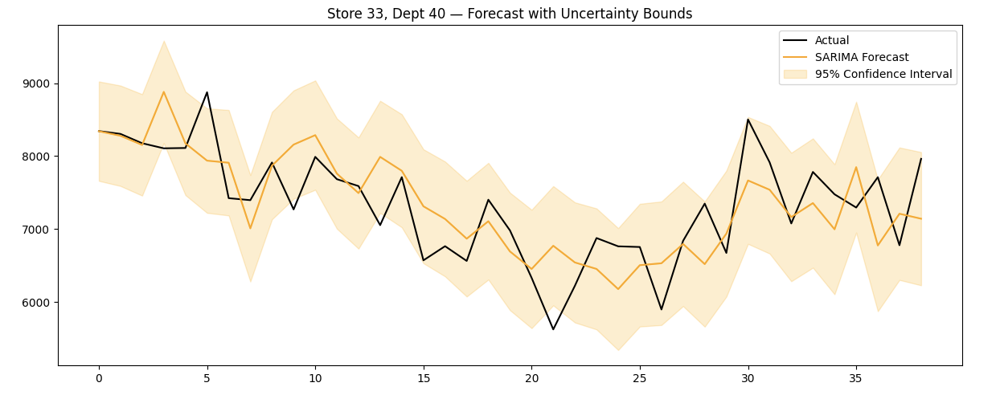

ხის და ღრმა სწავლების მოდელებისგან განსხვავებით, რომლებიც ამ პროექტში გამოვიყენეთ, SARIMA-ს აქვს 
რეალური, ჩაშენებული ნდობის ინტერვალები (confidence intervals). Store 33-ზე შევამოწმე, რამდენად 
სანდო იყო ეს ინტერვალები: ფაქტობრივი მნიშვნელობების 84.6% მოხვდა 95%-იან ინტერვალში (იდეალურ შემთხვევაში 
ეს მაჩვენებელი დაახლოებით 95% უნდა იყოს).

დასკვნა: ინტერვალები გარკვეულწილად ზედმეტად თავდაჯერებული (overconfident) აღმოჩნდა. რეალური 
მნიშვნელობების ნაკლები ნაწილი მოხვდა ინტერვალში, ვიდრე 95%-იანმა პროგნოზმა უნდა უზრუნველყოს. ეს არის 
SARIMA-სთვის ცნობილი შეზღუდვა, რომელიც გამომდინარეობს მისი დაშვებიდან, რომ შეცდომები მარტივი და 
სიმეტრიული ფორმით ნაწილდება და მათი გავრცელება დროთა განმავლობაში დაახლოებით ერთნაირია. მიუხედავად 
ამისა, მხოლოდ ამ მოდელს აქვს ჩვენს პროექტში რეალური, რაოდენობრივად შეფასებული გაურკვევლობის (uncertainty) წარმოდგენის უნარი.

### Arima და SARIMA საბოლოო შედარების ცხრილში

LightGBM-ის, XGBoost-ის, Prophet-ისა და TimesFM-ისგან განსხვავებით, ARIMA და SARIMA არ გაშვებულა სრულ 
დაახლოებით 3,300 სერიის მონაცემებზე და არ გამიშვია Kaggle-ზე რეალური leaderboard ქულის 
მისაღებად. დავალების ინსტრუქციის შესაბამისად, ამ ორ მოდელზე დროის მცირე ნაწილის დახარჯვა იყო რეკომენდებული.

---

## Prophet

Prophet თითოეული სერიისთვის ცალკე მოდელს ფიტავს (SARIMA-ს მსგავსად) და გაყიდვებს ყოფს რამდენიმე კომპონენტად: ტრენდად + წლიურ სეზონურობად + ცალკე მითითებულ სადღესასწაულო ეფექტებად. დალოგილია Prophet_Training-ში.

**Cleaning and Validation Split:** იგივე
**Representative series (5):** იგივვე რაც SARIMA (Store 1/1, 4/92, 20/1,
10/30, 33/40).

---

### Baseline vs SARIMA (იგივე 5 სერია)

| Series | Prophet (baseline) | SARIMA (mixed config) |
|---|---|---|
| Store 1, Dept 1 | 6247.15 | 10857.46 |
| Store 4, Dept 92 | 22410.44 | 10899.61 |
| Store 20, Dept 1 | 9916.36 | 26674.60 |
| Store 10, Dept 30 | 2001.53 | 3418.88 |
| Store 33, Dept 40 | 905.34 | 389.69 |

Prophet-მა 5 სერრიდან 3-ზე გაიმარჯვა და ხშირად დიდი უპირატესობითაც (Store 20: 9916 SARIMA-ს 26674-ის წინააღმდეგ). ამის სავარაუდო მიზეზია ის, რომ მისი გლუვი და ავტომატურად შესწავლილი წლიური სეზონურობა უკეთ უმკლავდება არარეგულარულ პიკებს, ვიდრე SARIMA-ს უფრო მკაცრი სეზონური კომპონენტები, განსაკუთრებით მაშინ, როდესაც მოდელს მხოლოდ დაახლოებით 2 წლის მონაცემები აქვს სასწავლად.

### Explicit Holidays (Thanksgiving, Christmas, Super Bowl, Labor Day)

| Series | With holidays | Without |
|---|---|---|
| Store 1, Dept 1 | 4503.17 | 6247.15 |
| Store 4, Dept 92 | 27527.26 | 22410.44 (worse) |
| Store 20, Dept 1 | 9926.91 | 9916.36 (flat) |
| Store 10, Dept 30 | 1799.72 | 2001.53 |
| Store 33, Dept 40 | 774.94 | 905.34 |

გააუმჯობესა 5 სერიიდან 4-ის შედეგი, განსხვავებით SARIMA-სა და N-BEATSx-ისგან (ორივემ დამატებითი სარგებელი ვერ იპოვა).

მიზეზი: SARIMA-ს სეზონური დიფერენცირება და N-BEATSx-ის 52-კვირიანი ფანჯარა უკვე ირიბად ითვალისწინებს დღესასწაულების პერიოდულობას. ამისგან განსხვავებით, Prophet-ის გლუვ Fourier-ზე დაფუძნებულ სეზონურობას არ აქვს მექანიზმი, რომელიც კონკრეტული კვირის მკვეთრ ეფექტებს დაიჭერს. ამიტომ, ცალკე მითითებულმა დღესასწაულის ინდიკატორმა (holiday flag) რეალურად დაამატა ახალი ინფორმაცია, რომელიც სხვა მოდელებს უკვე გააჩნდათ.

## Trend Flexibility

| Value | Avg WMAE (5 series) |
|---|---|
| **0.01 (საუკუთესო)** | **6003.91** |
| 0.05 (Prophet-ის დეფოლტი) | 8906.40 |
| 0.1 | 11076.64 |
| 0.5 | 16561.20 |

სუფთა და მონოტონური შედეგი: ტრენდის ნაკლები მოქნილობა უკეთეს შედეგს იძლევა. მან აჯობა Prophet-ის 
საკუთარ ბიბლიოთეკის სტანდარტულ პარამეტრებსაც კი 33%-ით. ეს არის იგივე დასკვნა, რომელიც პროექტის სხვა 
ნაწილებშიც გამოჩნდა: როდესაც მონაცემები შეზღუდულია (დაახლოებით 2 წელი თითოეული დროითი რიგისთვის), 
საჭიროა უფრო შეზღუდული და ნაკლები სირთულის მქონე მოდელების გამოყენება.

### სხვა კონფიგურაციები

- მულტიპლიკაციური სეზონურობა: უარესი შედეგი აჩვენა (+7.2%). რადგან თითოეული სერიისთვის ცალკე მოდელი იგება, მას არ აქვს მასშტაბებს შორის განსხვავების პრობლემა, რომლის გადაჭრაც დასჭირდებოდა, მხოლოდ ოვერფიტინგის რისკს ამატებს.
- კვირეული სეზონურობის გამორთვა: თავდაპირველად ჩანდა, რომ ეს რეალური გაუმჯობესება იყო (-3.5% 5 სერიაზე). თუმცა, სრული მასშტაბით დამატებითი შემოწმებისას აღმოჩნდა, რომ გაუმჯობესება საერთოდ გაქრა, ჩართულ და გამორთულ პარამეტრებს შორის შედეგები იდენტური იყო, რაც პირდაპირ დადასტურდა model.seasonalities-ის შემოწმებით. მიზეზი: Prophet-ის auto დეფოლტ პარამეტრი უკვე თავად ამჩნევს, რომ ჩვენს მონაცემებში კვირაში ერთი მნიშვნელობა გვაქვს და ავტომატურად თიშავს კვირეულ სეზონურობას. შესაბამისად, ცალკე მითითება საჭირო არ იყო; ადრეული 5-სერიული ტესტი რეალურად ადარებდა „იძულებით ჩართულს“ და „გამორთულს“, და არა „auto-ს“ და „გამორთულს“.
- უფრო ფართო ჰოლიდეი ფანჯარა (+-1 კვირა): ცალკე გამოყენებისას მცირე გაუმჯობესება აჩვენა (-2.8%), თუმცა ზემოთ აღნიშნულ ცვლილებებთან ერთად გამოყენებისას დამატებითი სარგებელი აღარ მოუტანია.

**საბოლოო კონფიგურაცია:** `changepoint_prior_scale=0.01`, explicit holidays.

### Full-Scale ვალიდაცია

**შედეგი: WMAE = 2817.95** 

### Second-Window Reliability Check

| მოდელი | Window 1 | Window 2 | სხვაივა |
|---|---|---|---|
| LightGBM | 2145.20 | 3168.27 | 48% |
| **Prophet** | **2817.95** | **3118.72** | **11%** |

Prophet ბევრად უფრო სტაბილურია სხვადასხვა ფანჯარაზე, ვიდრე LightGBM. ამის სავარაუდო მიზეზია ის, რომ 
Prophet-ის წინასწარ განსაზღვრული, მკაფიო სადღესასწაულო თარიღები არ არის დამოკიდებული იმაზე, თუ 
კონკრეტულად რომელი დროითი ფანჯარა მოწმდება. ამისგან განსხვავებით, LightGBM-ის lag  features მნიშვნელოვნად არის დამოკიდებული არჩეულ სასწავლო ფანჯარაზე.

### Confidence Intervals (Store 33)

79.5% 95%-იანი ინტერვალისთვის (უარესი შედეგი, ვიდრე SARIMA-ს 84.6% იმავე სერიაზე). ძირითადი მიზეზი, 
რომელიც დადასტურდა კომპონენტების გრაფიკის საშუალებით: Prophet-მა სწორად აღმოაჩინა Store 33-ის რეალური 
ზრდის ტრენდი ტრენინგ პერიოდში, თუმცა დაბალი changepoint პარამეტრი ამ ზრდის სიჩქარეს აფიქსირებს და ვერ 
ეგუება ცვლილებას, თუ პროგნოზირების პერიოდში რეალური ტრენდი უფრო სწრაფად იზრდება, სწორედ ეს მოხდა ამ 
შემთხვევაში. დღესასწაულის კომპონენტმა სწორად იმუშავა, მან სწორად აჩვენა მადლიერების დღის მკაფიო პიკები და შობის პერიოდის შემცირებები, რაც ემთხვევა EDA-ს დროს აღმოჩენილ პატერნს (+40% / -8.5%).

### Kaggle Score

| Metric | Score |
|---|---|
| Public | 2980.61 |
| Private | 3099.03 |

შიდა ვალიდაციის შედეგთან (2817.95) შედარებით სხვაობა მხოლოდ 6–10% არის, რაც მნიშვნელოვნად მცირეა, ვიდრე 
LightGBM-ის/XGBoost-ის დაახლოებით 46–52%-იანი სხვაობა. ეს შეესაბამება ზემოთ მიღებულ სანდოობის შემოწმების 
შედეგებს.

---

## TimesFM

TimesFM არის Google-ის წინასწარ გაწვრთნილი (pretrained) დროითი სერიების ფუნდამენტური მოდელი. ამ პროექტში გამოყენებული ყველა სხვა მოდელისგან განსხვავებით, TimesFM გამოიყენება zero-shot რეჟიმში, მას საერთოდ არ გაუვლია სწავლება Walmart-ის მონაცემებზე. ის მხოლოდ იღებს ისტორიული მონაცემების ნაწილს და პროგნოზირებს შემდეგ მნიშვნელობებს, იმ პატერნების საფუძველზე, რომლებიც სხვა, ერთმანეთისგან დამოუკიდებელ მონაცემებზე წინასწარი სწავლებისას ისწავლა.

ექსპერიმენტი დალოგილია TimesFM_Training MLflow ექსპერიმენტში.

**Cleaning და Validation Split:** იგივე.
**Representative series (5):** იგივე, რაც SARIMA/Prophet.

### Zero-Shot Baseline (Context = 104 weeks)

| Series | TimesFM (zero-shot) | SARIMA | Prophet |
|---|---|---|---|
| Store 1, Dept 1 | 4411.20 | 10857.46 | 6247.15 |
| Store 4, Dept 92 | 4197.59 | 10899.61 | 22410.44 |
| Store 20, Dept 1 | 9100.02 | 26674.60 | 9916.36 |
| Store 10, Dept 30 | 1145.05 | 3418.88 | 2001.53 |
| Store 33, Dept 40 | 948.27 | 389.69 | 905.34 |

TimesFM-მ (0 ტრენინგით) დაამარცხა SARIMA და Prophet 4-დან 5 სერიაში, უმეტესად დიდი მარჟით.

### Context Length

| Context (weeks) | Avg WMAE (5 series) |
|---|---|
| 26 | 5780.48 |
| 52 | 5598.09 |
| **104 (winner)** | **3960.43** |
| 128 | 3960.43 |

მეტი კონტექსტი კარგად დაეხმარა. აქ არ არის ოვერფიტის რისკი მეტი კონტექსტისგან.

### Covariates (IsHoliday, Store Type)

გაუმჯობესდა საშუალო WMAE 3960.43-დან **3807.36**-მდე (-3.9%, 5-დან 4 სერია).

| Model | Explicit holiday benefit? |
|---|---|
| LightGBM, SARIMA, N-BEATSx | არა |
| Prophet | კი |
| **TimesFM** | **კი** |

დამატებითმა კოვარიატებმა (CPI, უმუშევრობა, ტემპერატურა, ზომა) შედეგი გააუარესა (+13%), რაც შეესაბამება ყველა სხვა მოდელის შედეგებს, რომლებმაც ეს მახასიათებლები გამოცადეს.

normalize_inputs და window_size პარამეტრები შემოწმდა და დადასტურდა, რომ რეალური გავლენა არ ჰქონდათ (ბიტურ დონეზე სხვაობა დაახლოებით 0.001 იყო). ეს მკვეთრად განსხვავდება PatchTST-ისგან, რომელიც ნორმალიზაციის გარეშე კატასტროფულად ცუდ შედეგზე გადავიდა.

### Seasonal-Naive Blending

| Alpha | WMAE |
|---|---|
| 0.0 | 3807.36 |
| 0.3 | 3594.91 |
| **0.55 (საუკეთესო)** | **3591.46** |
| 0.7 | 3616.28 |
| 1.0 | 3720.87 |

იგივე მიდგომა, რომელმაც ამ პროექტში ყველა სხვა მოდელს დაეხმარა, აქაც ეფექტური აღმოჩნდა, თუმცა უფრო პატარა გაუმჯობესებით, 5.7%-იანი მოგებით.

### Quantile Calibration (Store 33)

80%-იან ინტერვალზე დაფარვა (coverage) იყო 51.3%, რაც ყველაზე ცუდ კალიბრაციას წარმოადგენს სამივე ინდივიდუალურად შეფასებულ მოდელს შორის (SARIMA - 84.6%, Prophet — 79.5%; ორივე შეფასებული იყო უფრო ფართო 95%-იანი ინტერვალებით).

მიზეზი: ამ კონკრეტულ, ტრენდით დომინირებულ სერიაზე გამოვლინდა იგივე სუსტი მხარე, რაც Prophet-ს ჰქონდა, 
TimesFM-ს არ გააჩნია ტრენდის ექსტრაპოლაციის პირდაპირი მექანიზმი, ამიტომ მან რეალური ზრდითი დრიფტი ვერ 
გაითვალისწინა და პროგნოზები რეალურ მნიშვნელობებზე დაბლა აღმოჩნდა.

### 6. Fine-Tuning

დადასტურდა, რომ მოდელი სრულად დასატრენინგებელია (231 მილიონი პარამეტრი, და ყველა მათგანს აქვს 
requires_grad=True). ამიტომ დავტოვოთ მღავარი მოდელი და დავატრენინგოთ მხოლოდ output head, რომელსაც 4.9 მილიონი პარამეტრი აქვს.

არ განხორციელებულა შემდეგი ნაბიჯი: შიდა forward() მეთოდი იყენებს არადოკუმენტირებულ decode_caches ტიპს, რომლისთვისაც საჯარო API დოკუმენტაცია არ არსებობს. მის საფუძველზე საკუთარი სასწავლო ციკლის (training loop) შექმნა რისკიანი იქნებოდა, რადგან შეიძლებოდა მიგვეღო შედეგები, რომლებიც გარეგნულად სწორად გამოიყურება, მაგრამ მცდარია.

რადგან TimesFM ამ პროექტში მხოლოდ ბონუს მოდელია, ეს რისკი არ ღირდა.

### Full-Scale Validation, შესწორებული

აქ აღმოვაჩინეთ და გამოვასწორეთ შეცდომა. პირველი სრული მასშტაბის გაშვებისას თითოეული სერია ფასდებოდა საკუთარი ბოლო 39 კვირის მიხედვით (დაახლოებით 2012 წლის თებერვლიდან ოქტომბრამდე), რაც ზუსტად ის naive ფანჯარა იყო, რომელიც პროექტის დასაწყისში უარვყავით, რადგან მასში არც მადლიერების დღე და არც შობა არ შედიოდა. შედეგად მიღებული იყო არასწორი და ზედმეტად მარტივი შედეგი (1629.55 blended), რომელიც სხვა მოდელების შედეგებთან შედარებადი არ იყო.

fix: კონტექსტი აიგო tr მონაცემებიდან და შეფასება ჩატარდა va მონაცემებზე, ზუსტად იმავე მეთოდით, როგორც ყველა სხვა მოდელის შემთხვევაში.

| ვერსია | No blend | With blend (α=0.55) |
|---|---|---|
| არასწორ | 1673.54 | 1629.55 |
| **შესწორებული** | **2699.26** | **2251.43** |
| Window 2 | 3011.61 | 2490.41 |

კორექტირებული შედეგი ხვდება ხის მოდელებსა და Prophet-ს შორის და აღარ არის ყველა სხვა მოდელზე უკეთესი, როგორც არასწორი შედეგი მიუთითებდა. მიუხედავად ამისა, zero-shot სწავლების პირობებში ეს მაინც ნამდვილად ძლიერი შედეგია, თუმცა ის ახალი საუკეთესო შედეგი გუნდისთვის არ არის.

| Model | Window 1 (შესწორებული) |
|---|---|
| LightGBM | 1811.11 |
| XGBoost | 1838.88 |
| **TimesFM** | **2251.43** |
| Prophet | 2817.95 |

თავდაპირველი pipeline-ის reload verification ძალიან დაფეილდა (მაქსიმალური სხვაობა 6182), რაც ბევრად აღემატება ჩვეულებრივ მცირე ცდომილებას.

მიზეზი პირდაპირ დადგინდა: TimesFM-ის კოვარიატების მექანიზმი (XReg) რეალურად იძლევა განსხვავებულ შედეგებს იმის მიხედვით, თუ რომელი სერიები ერთიანდება ერთსა და იმავე batch-ში. მიზეზი ის არის, რომ linear covariate fit იყენებს ინფორმაციას, რომელიც გაზიარებულია მთელ batch-ს შორის. დადასტურდა, რომ ეს შემთხვევითობის შედეგი არ იყო, ერთსა და იმავე სესიაში ორი იდენტური გაშვებისას სხვაობა იყო 0.0.

fix: pipeline შეიცვალა ისე, რომ ზუსტად იმეორებს batch_size=200 დაჯგუფებას, რომელიც გამოყენებული იყო თავდაპირველი submission-ის შესაქმნელად. გამოსწორების შემდეგ მაქსიმალური სხვაობა გახდა 5.82e-11, რაც ემთხვევა ყველა სხვა მოდელის სუფთა ვალიდაციის შედეგებს.

რეალური შეზღუდვა: ამ მოდელის მომავალში გამოყენებისას აუცილებელია იგივე batching-ის შენარჩუნება, რათა შედეგები განმეორებადი (reproducible) დარჩეს. ასეთი დამოკიდებულება batch-ზე ამ პროექტში გამოყენებულ არც ერთ სხვა მოდელს არ აქვს.

### Kaggle Score

| Metric | Score |
|---|---|
| Public | 2788.88 |
| Private | 2874.72 |

---
---

---

# MLflow Tracking

https://dagshub.com/Nestor-Dzadzamia/walmart-sales-forecasting.mlflow

Metrics: validation WMAE for every run (held-out and, where used,
cross-validation mean/std across time-based folds), plus model-specific
metrics such as blend alpha sweeps, context-length sweeps, and coverage
checks.
Parameters: hyperparameters for every configuration tested, feature
sets used, and scope notes for models evaluated on a limited number of
series (ARIMA, SARIMA).
Artifacts: the final trained pipeline for each model, logged with
mlflow.pyfunc, and verified by reloading it fresh from MLflow rather
than only testing the in-memory object.

### ჩაწერილი მეტრიკების აღწერა

- მეტრიკები: ყოველი run-ისთვის validation WMAE (held-out და, სადაც გამოვიყენეთ, cross-validation-ის mean/std დროზე დაფუძნებულ fold-ებში), ასევე მოდელისთვის სპეციფიკური მეტრიკები, როგორიცაა blend alpha-ს sweep-ები, context-length-ის sweep-ები, coverage-ის შემოწმებები და ა.შ.
- პარამეტრები: hyperparameter-ები ყოველი ტესტირებული კონფიგურაციისთვის, გამოყენებული feature set-ები, და scope-ის ნოუთები იმ მოდელებისთვის, რომლებიც შემოწმდა შეზღუდულ რაოდენობის series-ზე.
- Artifact-ები: ყოველი მოდელის საბოლოო trained pipeline, ჩაწერილი mlflow.pyfunc-ით, და გადამოწმებული MLflow-დან თავიდან reload-ის გზით.

### საუკეთესო მოდელების შედეგები:

| მოდელი | Validation WMAE |
|---|---|
| **LightGBM (საუკეთესო)** | **1811.11** |
| XGBoost | 1838.88 |
| TimesFM (bonus) | 2251.43 |
| N-BEATS | 2342 |
| PatchTST | 2529 |
| Prophet | 2817.95 |
| TFT (bonus) | 2869.22 |
| DLinear | 3386 |

ARIMA და SARIMA არ შედის ამ შედარებაში, რადგან დავალების მოთხოვნის შესაბამისად, ამ ორ მოდელზე 
დახარჯული დრო შეზღუდული იყო. ამიტომ, ისინი შეფასდა მხოლოდ რამდენიმე წარმომადგენლობით დროით სერიაზე 
და არა მთლიან დატასეტზე. თითოეული სერიის შედეგები წარმოდგენილია შესაბამის სექციაში.

##  Model-ის Registry და Inference

საუკეთესო მოდელი (LightGBM, val WMAE 1811) რეგისტრირდება MLflow Model Registry-ში. `model_inference.ipynb`:

1. არეგისტრირებს საუკეთესო pipeline-ს Registry-ში,
2. ტვირთავს მას **პირდაპირ Registry-დან** (სახელით და ვერსიით),
3. უშვებს დაუმუშავებელ test.csv-ზე და აგენერირებს `final_submission.csv`-ს.
